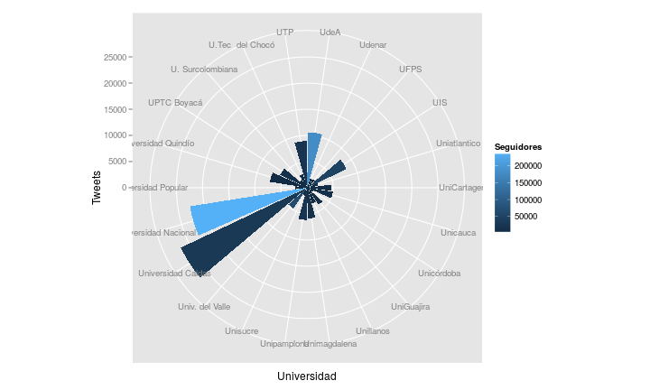

## Contenido 

> + Una breve introducción 
    - Por que minería de datos?
    - Que es minería de datos?
    - Minería de datos: Un proceso de descubrimiento del conocimiento (kdd)
    - Minería de datos: Una visión multidimensional
        * Minería de datos desde el punto de vista de los datos
        * Minería de datos desde el punto de vista del conocimiento
        * Minería de datos desde el punto de vista metodológico
        * Minería de datos desde el punto de vista de la aplicación.
        


---


## Contenido 

> + Obtención y Manipulación de datos 
    - Datos en bruto y procesado
    - Componentes de los datos ordenados.
    - Obtención de datos locales.
    - Lectura desde bases de datos.
    - Leyendo datos de la web y redes sociales. 
    - Indexación, ordenado y resumen de datos.
    - Reorganización y fusionado de datos
    - Trabajando con fechas, edición de textos y expresiones regulares. 


---


## Contenido 

> + Algoritmos de modelado de datos 
    - Descubrimiento de patrones en data mining. 
    - Concepto de clúster, técnicas de clúster en data mining y clúster en grandes dimensiones.
    - Concepto de asociación y correlación en data mining, técnicas de asociación y correlación en data mining.
    - Regresión conceptos en data mining, técnicas de regresión en data mining  
    - Algoritmos del machine learning en data mining (Redes neuronales, algoritmos genéticos y procesos de simulación).


---


## Contenido

> + Validación y selección de modelos en data mining
   - Diseño de estudio de validación
   - Validación cruzada, error de muestreo e importancia relativa    
   - Validación, selección e interpretación de patrones en data mining
   - Data de entrenamiento 
   - Visualización de patrones en data mining. 


---


## Contenido 

> + Visualización de datos
    - Introducción a la visualización de datos
    - Visualización de datos numéricos
    - Visualización de datos no numéricos 
    - Tableros de visualización de datos.
    
    

---


## Contenido

> + Tex mining
    - Recolección de información de texto e ingeniería de búsquedas.
    - Procesado natural del lenguaje (NPL).
    - Asociación de palabras, análisis de tópicos en textos y análisis de sentimientos.
    - Modelos de predicción en tex mining.


---


## Por que minería de datos?

> - Crecimiento explosivo de los datos 
    * Explosión de los datos: Nuestra capacidad de generar , recopilar, almacenar, y gestionar datos ha crecido enormemente en los últimos 50 años
    * Las principales fuentes de datos 
        + Web y la sociedad de información : Noticias, medios digitales , redes sociales , el comercio electrónico, transacciones , acciones, ...
        + Ciencia e ingeniería : La teledetección , bioinformática , simulación científica, ...
    * Nos estamos ahogando en datos, pero hambrientos de conocimiento!
    


---


## Que es la minería de datos?

- Minería de datos: descubrieminto del conocimiento a partir de los datos (kdd)

    * Extración de interesantes (no triviales, implícitos, previamente desconocidos y potencialmente útil) 
    patrones o conocimientos de datos masivos 
    * La minería de datos: Un nombre inapropiado?
        + La minería del conocimiento a partir de datos!
    * La minería de datos: Su relación con otras disciplinas
        + Aprendizaje automático, reconocimiento de patrones, estadística, bases de datos,
inteligencia de negocios, Big Data, ...

---    

## Minería de datos: Un proceso de descubrimiento del conocimiento (kdd) 


---


## Minería de datos: Una visión multidimensional

> - La minería de datos se puede ver desde varios ángulos
    * Los datos que se extraen
    * El conocimiento que se extrae
    * Metodologías o técnicas utilizadas
    * Aplicaciones adaptadas

---


## Punto de vista de los datos: ¿Qué tipo de datos?

> - Datos estructurados y semi-estructurados 
    * Datos relacionales/datos de objeto-relacionales
    * Datos de bodegas de datos
    * Datos transaccionales 
    
> - Datos estructurados
    * Datos de texto y datos de la web
    * Datos espaciales y espaciotemporales
    * Datos de multimedia 
    * Datos de flujos y sensores 
    * Datos de series de tiempo y datos secuenciales 
    * Grafos, redes sociales y redes de información
    

---

## Punto de vista del conocimiento: Conocimiento a extraer

> - Resumen de datos en espacios multidimiencionales 
    * Cubos de datos y OLAP (On-Line Analytical Processing)
> - Descubrimiento de patrones 
    * Minería de patrones frecuentes, asociación y correlación
> - Modelos de clasificación y modelos predictivos
    * Construcción de modelos sobre la base de algunos ejemplos 
    * Predicción de nuevos datos basados en modelos construidos
> - Análisis de cluster: Cómo agrupar datos para formar nuevas categorías?
> - Análisis de outlier: El descubrimiento de anomalías y eventos raros
> - Tendencias y análisis de evolución


---


## Punto de vista metdológico: Confluencia de multiples disciplinas 


---


## Puntos de vista aplicativo: Diversidad de aplicaciones

> - Minería de texto y minería en la web
    * Clasificación de paginas web, análisis de Weblog, sistemas de recomendación
, etc

> - Minería en datos de negocios 
    * Datos transaccionales, market basket analysis, detección de fraude, etc
> - La minería de datos e ingeniería de software, ej: minando bugs en software
> - Extrayendo datos biologicos y medicos
    * Genes, proteinas, redes biologicas
> - Minando información de redes sociales 


---


## Get/set tu directorio de trabajo 

* Un componente básico de trabajar con datos es conocer su directorio de trabajo
* Los dos comandos principales son ```getwd()``` y ```setwd()```. 
* Tenga en cuenta las rutas relatvias vs las absolutas
  * __Relativa__ - ```setwd("./data")```, ```setwd("../")```
  * __Absoluta__ - ```setwd("/Users/name/data/")```
* Diferencia importante en Windows ```setwd("C:\\Users\\Name\\Downloads")```

---

## Comprobación y creación de directorios

* ```file.exists("NombreDirectorio")``` comprueba si existe el directorio
* ```dir.create("NombreDirectorio")``` creará un directorio si no existe
* Aquí un ejemplo de comprobación del directeorio "data" y su creación si no existe 


```r
if(!file.exists("Data")){
  dir.create("Data")
}
```

---

## Obteniendo datos de internet - download.file()

* Descarga un archivo de internet
* Incluso si se pudiera hacer esto a mano, ayuda con la reproducibilidad
* Los parámetros importantes son  **_url_**, **_destfile_**, **_method_**
* Útil para la descarga de **_delimitados-tab_**, **_csv_**, y otros archivos

---

## Ejemplo - Baltimore camera data


[https://data.baltimorecity.gov/Transportation/Baltimore-Fixed-Speed-Cameras/dz54-2aru](https://data.baltimorecity.gov/Transportation/Baltimore-Fixed-Speed-Cameras/dz54-2aru)


---

## Ejemplo - Baltimore camera data


[https://data.baltimorecity.gov/Transportation/Baltimore-Fixed-Speed-Cameras/dz54-2aru](https://data.baltimorecity.gov/Transportation/Baltimore-Fixed-Speed-Cameras/dz54-2aru)

---

## Descargando un archivo de la web


```r
fileUrl <- "http://data.baltimorecity.gov/api/views/dz54-2aru/rows.csv?accessType=DOWNLOAD"
download.file(fileUrl,destfile="/home/kevin/GettingData/Data/cameras.csv")
list.files("/home/kevin/GettingData/Data")
```

```
## [1] "cameras.csv"
```

```r
#dateDownloaded <- date()
#dateDownloaded
```

---

## Algunas notas sobre download.file()

* Si la url comienza con _http_ puedes usar download.file()
* Si la url comienza con _https_ en Windows puedes estar tranquilo
* Si la url comienza con _https_ en Mac puede que tengas que configurar _method="curl"_
* Si el archivo es muy grande, puede tomarte algún tiempo
* Asegúrese de registrar la descarga

---

## XML

* Extensible markup language
* Frecuentemente utilizado para almacenar datos estructurados
* Particularmente utilizado ampliamente en aplicaciones de internet
* La extracción de XML es la base para la mayoría del web scraping
* Componentes
  * Markup - etiquetas que dan la estructura del texto
  * Content - el texto real del documento

[http://es.wikipedia.org/wiki/Extensible_Markup_Language](http://es.wikipedia.org/wiki/Extensible_Markup_Language)

---

## Etiquetas, elementos y atributos

* Tags corresponden a las etiquetas generales
  * Comienzo de tags `<section>`
  * Fin de tags `</section>`
  * Tags vacias `<line-break />`
* Elements son ejemplos especificos de las tags
  * `<Greeting> Hola, mundo </Greeting>`
* Attributes son componentes de la etiqueta
  * ``
  * `<step number="3"> Connect A to B. </step>`

[http://es.wikipedia.org/wiki/Extensible_Markup_Language](http://es.wikipedia.org/wiki/Extensible_Markup_Language)

---

## Ejemplo de un archivo XML 


[http://www.w3schools.com/xml/simple.xml](http://www.w3schools.com/xml/simple.xml)

---

## Leer el archivo en R


```r
library(XML)
fileUrl <- "http://www.w3schools.com/xml/simple.xml"
doc <- xmlTreeParse(fileUrl,useInternal=TRUE)
rootNode <- xmlRoot(doc)
xmlName(rootNode)
```

```
## [1] "breakfast_menu"
```

```r
names(rootNode)
```

```
##   food   food   food   food   food 
## "food" "food" "food" "food" "food"
```

---

## Acceder directamente a partes del documento XML


```r
rootNode[[1]]
```

```
## <food>
##   <name>Belgian Waffles</name>
##   <price>$5.95</price>
##   <description>Two of our famous Belgian Waffles with plenty of real maple syrup</description>
##   <calories>650</calories>
## </food>
```

```r
rootNode[[1]][[1]]
```

```
## <name>Belgian Waffles</name>
```

---

## Extraer programáticamente partes del archivo


```r
xmlSApply(rootNode,xmlValue)
```

```
##                                                                                                                     food 
##                               "Belgian Waffles$5.95Two of our famous Belgian Waffles with plenty of real maple syrup650" 
##                                                                                                                     food 
##                    "Strawberry Belgian Waffles$7.95Light Belgian waffles covered with strawberries and whipped cream900" 
##                                                                                                                     food 
## "Berry-Berry Belgian Waffles$8.95Light Belgian waffles covered with an assortment of fresh berries and whipped cream900" 
##                                                                                                                     food 
##                                                "French Toast$4.50Thick slices made from our homemade sourdough bread600" 
##                                                                                                                     food 
##                         "Homestyle Breakfast$6.95Two eggs, bacon or sausage, toast, and our ever-popular hash browns950"
```

---

## XPath

* _/node_ Nodo de nivel superior
* _//node_ Nodo en cualquier nivel
* _node[@attr-name]_ Nodo con un nombre de atributo
* _node[@attr-name='bob']_ Nodo con nombre de atributo attr-name='bob'

Information from: [http://www.stat.berkeley.edu/~statcur/Workshop2/Presentations/XML.pdf](http://www.stat.berkeley.edu/~statcur/Workshop2/Presentations/XML.pdf)

---

## Obtener los elementos en el menú y sus precios


```r
xpathSApply(rootNode,"//name",xmlValue)
```

```
## [1] "Belgian Waffles"             "Strawberry Belgian Waffles" 
## [3] "Berry-Berry Belgian Waffles" "French Toast"               
## [5] "Homestyle Breakfast"
```

```r
xpathSApply(rootNode,"//price",xmlValue)
```

```
## [1] "$5.95" "$7.95" "$8.95" "$4.50" "$6.95"
```

---

## Otro ejemplo


[http://espn.go.com/nfl/team/schedule/_/name/bal/year/2013](http://espn.go.com/nfl/team/schedule/_/name/bal/year/2013)

---

## Viendo el código fuente 


[http://espn.go.com/nfl/team/schedule/_/name/bal/year/2013](http://espn.go.com/nfl/team/schedule/_/name/bal/year/2013)

---

## Extrayendo el contenido por atributos 


```r
fileUrl <- "http://espn.go.com/nfl/team/schedule/_/name/bal/year/2013"
doc <- htmlTreeParse(fileUrl,useInternal=TRUE)
scores <- xpathSApply(doc,"//li[@class='score']",xmlValue)
teams <- xpathSApply(doc,"//li[@class='team-name']",xmlValue)
scores
```

```
##  [1] "49-27"    "14-6"     "30-9"     "23-20"    "26-23"    "19-17"   
##  [7] "19-16"    "24-18"    "20-17 OT" "23-20 OT" "19-3"     "22-20"   
## [13] "29-26"    "18-16"    "41-7"     "34-17"    "44-16"    "27-23"   
## [19] "34-27"    "24-21"
```

```r
teams
```

```
##  [1] "Denver"      "Cleveland"   "Houston"     "Buffalo"     "Miami"      
##  [6] "Green Bay"   "Pittsburgh"  "Cleveland"   "Cincinnati"  "Chicago"    
## [11] "New York"    "Pittsburgh"  "Minnesota"   "Detroit"     "New England"
## [16] "Cincinnati"  "Tampa Bay"   "Atlanta"     "Carolina"    "St. Louis"
```

---

## Notas y más recursos

* Tutoriales oficiales de XML  [Resumido](http://www.omegahat.org/RSXML/shortIntro.pdf), [Completo](http://www.omegahat.org/RSXML/Tour.pdf)
* [Una excelente guía  para el paquete XML](http://www.stat.berkeley.edu/~statcur/Workshop2/Presentations/XML.pdf)


---


## JSON

* Javascript Object Notation
* Almacenamiento de datos Ligero
* Formato común para los datos de las interfaces de programación de aplicaciones (APIs)
* Similar en estructura a XML pero con diferente sintaxis/formato
* os datos son almacenados como
  * Numbers (double)
  * Strings (double quoted)
  * Boolean (_true_ o _false_)
  * Array (ordenado, separados por comas encerrados entre corchetes _[]_)
  * Object (desordenados, separados por comas colección de clave: pares de valores entre llaves _{}_)

[http://es.wikipedia.org/wiki/JSON](http://es.wikipedia.org/wiki/JSON)


---

## Example JSON file


---

## Leyendo datos de JSON {jsonlite package}


```r
library(jsonlite)
jsonData <- fromJSON("https://api.github.com/users/jtleek/repos")
head(jsonData$name, 22)
```

```
##  [1] "advdatasci"              "ballgown"               
##  [3] "capitalIn21stCenturyinR" "careerplanning"         
##  [5] "dataanalysis"            "datascientist"          
##  [7] "datasharing"             "datawomenontwitter"     
##  [9] "derfinder"               "derfinder-1"            
## [11] "DSM"                     "EDA-Project"            
## [13] "futureofstats"           "genomicspapers"         
## [15] "googleCite"              "graduate"               
## [17] "healthvis"               "hyde"                   
## [19] "inclassfeb62014"         "jhsph753"               
## [21] "jhsph753and4"            "jtleek.github.io"
```

---

## Objetos anidados en JSON


```r
names(jsonData$owner)
```

```
##  [1] "login"               "id"                  "avatar_url"         
##  [4] "gravatar_id"         "url"                 "html_url"           
##  [7] "followers_url"       "following_url"       "gists_url"          
## [10] "starred_url"         "subscriptions_url"   "organizations_url"  
## [13] "repos_url"           "events_url"          "received_events_url"
## [16] "type"                "site_admin"
```

```r
jsonData$owner$login
```

```
##  [1] "jtleek" "jtleek" "jtleek" "jtleek" "jtleek" "jtleek" "jtleek"
##  [8] "jtleek" "jtleek" "jtleek" "jtleek" "jtleek" "jtleek" "jtleek"
## [15] "jtleek" "jtleek" "jtleek" "jtleek" "jtleek" "jtleek" "jtleek"
## [22] "jtleek" "jtleek" "jtleek" "jtleek" "jtleek" "jtleek" "jtleek"
## [29] "jtleek" "jtleek"
```

---

## Escribiendo data frames como JSON


```r
myjson <- toJSON(iris, pretty=TRUE)
cat(myjson)
```

```
## [
##   {
##     "Sepal.Length": 5.1,
##     "Sepal.Width": 3.5,
##     "Petal.Length": 1.4,
##     "Petal.Width": 0.2,
##     "Species": "setosa"
##   },
##   {
##     "Sepal.Length": 4.9,
##     "Sepal.Width": 3,
##     "Petal.Length": 1.4,
##     "Petal.Width": 0.2,
##     "Species": "setosa"
##   },
##   {
##     "Sepal.Length": 4.7,
##     "Sepal.Width": 3.2,
##     "Petal.Length": 1.3,
##     "Petal.Width": 0.2,
##     "Species": "setosa"
##   },
##   {
##     "Sepal.Length": 4.6,
##     "Sepal.Width": 3.1,
##     "Petal.Length": 1.5,
##     "Petal.Width": 0.2,
##     "Species": "setosa"
##   },
##   {
##     "Sepal.Length": 5,
##     "Sepal.Width": 3.6,
##     "Petal.Length": 1.4,
##     "Petal.Width": 0.2,
##     "Species": "setosa"
##   },
##   {
##     "Sepal.Length": 5.4,
##     "Sepal.Width": 3.9,
##     "Petal.Length": 1.7,
##     "Petal.Width": 0.4,
##     "Species": "setosa"
##   },
##   {
##     "Sepal.Length": 4.6,
##     "Sepal.Width": 3.4,
##     "Petal.Length": 1.4,
##     "Petal.Width": 0.3,
##     "Species": "setosa"
##   },
##   {
##     "Sepal.Length": 5,
##     "Sepal.Width": 3.4,
##     "Petal.Length": 1.5,
##     "Petal.Width": 0.2,
##     "Species": "setosa"
##   },
##   {
##     "Sepal.Length": 4.4,
##     "Sepal.Width": 2.9,
##     "Petal.Length": 1.4,
##     "Petal.Width": 0.2,
##     "Species": "setosa"
##   },
##   {
##     "Sepal.Length": 4.9,
##     "Sepal.Width": 3.1,
##     "Petal.Length": 1.5,
##     "Petal.Width": 0.1,
##     "Species": "setosa"
##   },
##   {
##     "Sepal.Length": 5.4,
##     "Sepal.Width": 3.7,
##     "Petal.Length": 1.5,
##     "Petal.Width": 0.2,
##     "Species": "setosa"
##   },
##   {
##     "Sepal.Length": 4.8,
##     "Sepal.Width": 3.4,
##     "Petal.Length": 1.6,
##     "Petal.Width": 0.2,
##     "Species": "setosa"
##   },
##   {
##     "Sepal.Length": 4.8,
##     "Sepal.Width": 3,
##     "Petal.Length": 1.4,
##     "Petal.Width": 0.1,
##     "Species": "setosa"
##   },
##   {
##     "Sepal.Length": 4.3,
##     "Sepal.Width": 3,
##     "Petal.Length": 1.1,
##     "Petal.Width": 0.1,
##     "Species": "setosa"
##   },
##   {
##     "Sepal.Length": 5.8,
##     "Sepal.Width": 4,
##     "Petal.Length": 1.2,
##     "Petal.Width": 0.2,
##     "Species": "setosa"
##   },
##   {
##     "Sepal.Length": 5.7,
##     "Sepal.Width": 4.4,
##     "Petal.Length": 1.5,
##     "Petal.Width": 0.4,
##     "Species": "setosa"
##   },
##   {
##     "Sepal.Length": 5.4,
##     "Sepal.Width": 3.9,
##     "Petal.Length": 1.3,
##     "Petal.Width": 0.4,
##     "Species": "setosa"
##   },
##   {
##     "Sepal.Length": 5.1,
##     "Sepal.Width": 3.5,
##     "Petal.Length": 1.4,
##     "Petal.Width": 0.3,
##     "Species": "setosa"
##   },
##   {
##     "Sepal.Length": 5.7,
##     "Sepal.Width": 3.8,
##     "Petal.Length": 1.7,
##     "Petal.Width": 0.3,
##     "Species": "setosa"
##   },
##   {
##     "Sepal.Length": 5.1,
##     "Sepal.Width": 3.8,
##     "Petal.Length": 1.5,
##     "Petal.Width": 0.3,
##     "Species": "setosa"
##   },
##   {
##     "Sepal.Length": 5.4,
##     "Sepal.Width": 3.4,
##     "Petal.Length": 1.7,
##     "Petal.Width": 0.2,
##     "Species": "setosa"
##   },
##   {
##     "Sepal.Length": 5.1,
##     "Sepal.Width": 3.7,
##     "Petal.Length": 1.5,
##     "Petal.Width": 0.4,
##     "Species": "setosa"
##   },
##   {
##     "Sepal.Length": 4.6,
##     "Sepal.Width": 3.6,
##     "Petal.Length": 1,
##     "Petal.Width": 0.2,
##     "Species": "setosa"
##   },
##   {
##     "Sepal.Length": 5.1,
##     "Sepal.Width": 3.3,
##     "Petal.Length": 1.7,
##     "Petal.Width": 0.5,
##     "Species": "setosa"
##   },
##   {
##     "Sepal.Length": 4.8,
##     "Sepal.Width": 3.4,
##     "Petal.Length": 1.9,
##     "Petal.Width": 0.2,
##     "Species": "setosa"
##   },
##   {
##     "Sepal.Length": 5,
##     "Sepal.Width": 3,
##     "Petal.Length": 1.6,
##     "Petal.Width": 0.2,
##     "Species": "setosa"
##   },
##   {
##     "Sepal.Length": 5,
##     "Sepal.Width": 3.4,
##     "Petal.Length": 1.6,
##     "Petal.Width": 0.4,
##     "Species": "setosa"
##   },
##   {
##     "Sepal.Length": 5.2,
##     "Sepal.Width": 3.5,
##     "Petal.Length": 1.5,
##     "Petal.Width": 0.2,
##     "Species": "setosa"
##   },
##   {
##     "Sepal.Length": 5.2,
##     "Sepal.Width": 3.4,
##     "Petal.Length": 1.4,
##     "Petal.Width": 0.2,
##     "Species": "setosa"
##   },
##   {
##     "Sepal.Length": 4.7,
##     "Sepal.Width": 3.2,
##     "Petal.Length": 1.6,
##     "Petal.Width": 0.2,
##     "Species": "setosa"
##   },
##   {
##     "Sepal.Length": 4.8,
##     "Sepal.Width": 3.1,
##     "Petal.Length": 1.6,
##     "Petal.Width": 0.2,
##     "Species": "setosa"
##   },
##   {
##     "Sepal.Length": 5.4,
##     "Sepal.Width": 3.4,
##     "Petal.Length": 1.5,
##     "Petal.Width": 0.4,
##     "Species": "setosa"
##   },
##   {
##     "Sepal.Length": 5.2,
##     "Sepal.Width": 4.1,
##     "Petal.Length": 1.5,
##     "Petal.Width": 0.1,
##     "Species": "setosa"
##   },
##   {
##     "Sepal.Length": 5.5,
##     "Sepal.Width": 4.2,
##     "Petal.Length": 1.4,
##     "Petal.Width": 0.2,
##     "Species": "setosa"
##   },
##   {
##     "Sepal.Length": 4.9,
##     "Sepal.Width": 3.1,
##     "Petal.Length": 1.5,
##     "Petal.Width": 0.2,
##     "Species": "setosa"
##   },
##   {
##     "Sepal.Length": 5,
##     "Sepal.Width": 3.2,
##     "Petal.Length": 1.2,
##     "Petal.Width": 0.2,
##     "Species": "setosa"
##   },
##   {
##     "Sepal.Length": 5.5,
##     "Sepal.Width": 3.5,
##     "Petal.Length": 1.3,
##     "Petal.Width": 0.2,
##     "Species": "setosa"
##   },
##   {
##     "Sepal.Length": 4.9,
##     "Sepal.Width": 3.6,
##     "Petal.Length": 1.4,
##     "Petal.Width": 0.1,
##     "Species": "setosa"
##   },
##   {
##     "Sepal.Length": 4.4,
##     "Sepal.Width": 3,
##     "Petal.Length": 1.3,
##     "Petal.Width": 0.2,
##     "Species": "setosa"
##   },
##   {
##     "Sepal.Length": 5.1,
##     "Sepal.Width": 3.4,
##     "Petal.Length": 1.5,
##     "Petal.Width": 0.2,
##     "Species": "setosa"
##   },
##   {
##     "Sepal.Length": 5,
##     "Sepal.Width": 3.5,
##     "Petal.Length": 1.3,
##     "Petal.Width": 0.3,
##     "Species": "setosa"
##   },
##   {
##     "Sepal.Length": 4.5,
##     "Sepal.Width": 2.3,
##     "Petal.Length": 1.3,
##     "Petal.Width": 0.3,
##     "Species": "setosa"
##   },
##   {
##     "Sepal.Length": 4.4,
##     "Sepal.Width": 3.2,
##     "Petal.Length": 1.3,
##     "Petal.Width": 0.2,
##     "Species": "setosa"
##   },
##   {
##     "Sepal.Length": 5,
##     "Sepal.Width": 3.5,
##     "Petal.Length": 1.6,
##     "Petal.Width": 0.6,
##     "Species": "setosa"
##   },
##   {
##     "Sepal.Length": 5.1,
##     "Sepal.Width": 3.8,
##     "Petal.Length": 1.9,
##     "Petal.Width": 0.4,
##     "Species": "setosa"
##   },
##   {
##     "Sepal.Length": 4.8,
##     "Sepal.Width": 3,
##     "Petal.Length": 1.4,
##     "Petal.Width": 0.3,
##     "Species": "setosa"
##   },
##   {
##     "Sepal.Length": 5.1,
##     "Sepal.Width": 3.8,
##     "Petal.Length": 1.6,
##     "Petal.Width": 0.2,
##     "Species": "setosa"
##   },
##   {
##     "Sepal.Length": 4.6,
##     "Sepal.Width": 3.2,
##     "Petal.Length": 1.4,
##     "Petal.Width": 0.2,
##     "Species": "setosa"
##   },
##   {
##     "Sepal.Length": 5.3,
##     "Sepal.Width": 3.7,
##     "Petal.Length": 1.5,
##     "Petal.Width": 0.2,
##     "Species": "setosa"
##   },
##   {
##     "Sepal.Length": 5,
##     "Sepal.Width": 3.3,
##     "Petal.Length": 1.4,
##     "Petal.Width": 0.2,
##     "Species": "setosa"
##   },
##   {
##     "Sepal.Length": 7,
##     "Sepal.Width": 3.2,
##     "Petal.Length": 4.7,
##     "Petal.Width": 1.4,
##     "Species": "versicolor"
##   },
##   {
##     "Sepal.Length": 6.4,
##     "Sepal.Width": 3.2,
##     "Petal.Length": 4.5,
##     "Petal.Width": 1.5,
##     "Species": "versicolor"
##   },
##   {
##     "Sepal.Length": 6.9,
##     "Sepal.Width": 3.1,
##     "Petal.Length": 4.9,
##     "Petal.Width": 1.5,
##     "Species": "versicolor"
##   },
##   {
##     "Sepal.Length": 5.5,
##     "Sepal.Width": 2.3,
##     "Petal.Length": 4,
##     "Petal.Width": 1.3,
##     "Species": "versicolor"
##   },
##   {
##     "Sepal.Length": 6.5,
##     "Sepal.Width": 2.8,
##     "Petal.Length": 4.6,
##     "Petal.Width": 1.5,
##     "Species": "versicolor"
##   },
##   {
##     "Sepal.Length": 5.7,
##     "Sepal.Width": 2.8,
##     "Petal.Length": 4.5,
##     "Petal.Width": 1.3,
##     "Species": "versicolor"
##   },
##   {
##     "Sepal.Length": 6.3,
##     "Sepal.Width": 3.3,
##     "Petal.Length": 4.7,
##     "Petal.Width": 1.6,
##     "Species": "versicolor"
##   },
##   {
##     "Sepal.Length": 4.9,
##     "Sepal.Width": 2.4,
##     "Petal.Length": 3.3,
##     "Petal.Width": 1,
##     "Species": "versicolor"
##   },
##   {
##     "Sepal.Length": 6.6,
##     "Sepal.Width": 2.9,
##     "Petal.Length": 4.6,
##     "Petal.Width": 1.3,
##     "Species": "versicolor"
##   },
##   {
##     "Sepal.Length": 5.2,
##     "Sepal.Width": 2.7,
##     "Petal.Length": 3.9,
##     "Petal.Width": 1.4,
##     "Species": "versicolor"
##   },
##   {
##     "Sepal.Length": 5,
##     "Sepal.Width": 2,
##     "Petal.Length": 3.5,
##     "Petal.Width": 1,
##     "Species": "versicolor"
##   },
##   {
##     "Sepal.Length": 5.9,
##     "Sepal.Width": 3,
##     "Petal.Length": 4.2,
##     "Petal.Width": 1.5,
##     "Species": "versicolor"
##   },
##   {
##     "Sepal.Length": 6,
##     "Sepal.Width": 2.2,
##     "Petal.Length": 4,
##     "Petal.Width": 1,
##     "Species": "versicolor"
##   },
##   {
##     "Sepal.Length": 6.1,
##     "Sepal.Width": 2.9,
##     "Petal.Length": 4.7,
##     "Petal.Width": 1.4,
##     "Species": "versicolor"
##   },
##   {
##     "Sepal.Length": 5.6,
##     "Sepal.Width": 2.9,
##     "Petal.Length": 3.6,
##     "Petal.Width": 1.3,
##     "Species": "versicolor"
##   },
##   {
##     "Sepal.Length": 6.7,
##     "Sepal.Width": 3.1,
##     "Petal.Length": 4.4,
##     "Petal.Width": 1.4,
##     "Species": "versicolor"
##   },
##   {
##     "Sepal.Length": 5.6,
##     "Sepal.Width": 3,
##     "Petal.Length": 4.5,
##     "Petal.Width": 1.5,
##     "Species": "versicolor"
##   },
##   {
##     "Sepal.Length": 5.8,
##     "Sepal.Width": 2.7,
##     "Petal.Length": 4.1,
##     "Petal.Width": 1,
##     "Species": "versicolor"
##   },
##   {
##     "Sepal.Length": 6.2,
##     "Sepal.Width": 2.2,
##     "Petal.Length": 4.5,
##     "Petal.Width": 1.5,
##     "Species": "versicolor"
##   },
##   {
##     "Sepal.Length": 5.6,
##     "Sepal.Width": 2.5,
##     "Petal.Length": 3.9,
##     "Petal.Width": 1.1,
##     "Species": "versicolor"
##   },
##   {
##     "Sepal.Length": 5.9,
##     "Sepal.Width": 3.2,
##     "Petal.Length": 4.8,
##     "Petal.Width": 1.8,
##     "Species": "versicolor"
##   },
##   {
##     "Sepal.Length": 6.1,
##     "Sepal.Width": 2.8,
##     "Petal.Length": 4,
##     "Petal.Width": 1.3,
##     "Species": "versicolor"
##   },
##   {
##     "Sepal.Length": 6.3,
##     "Sepal.Width": 2.5,
##     "Petal.Length": 4.9,
##     "Petal.Width": 1.5,
##     "Species": "versicolor"
##   },
##   {
##     "Sepal.Length": 6.1,
##     "Sepal.Width": 2.8,
##     "Petal.Length": 4.7,
##     "Petal.Width": 1.2,
##     "Species": "versicolor"
##   },
##   {
##     "Sepal.Length": 6.4,
##     "Sepal.Width": 2.9,
##     "Petal.Length": 4.3,
##     "Petal.Width": 1.3,
##     "Species": "versicolor"
##   },
##   {
##     "Sepal.Length": 6.6,
##     "Sepal.Width": 3,
##     "Petal.Length": 4.4,
##     "Petal.Width": 1.4,
##     "Species": "versicolor"
##   },
##   {
##     "Sepal.Length": 6.8,
##     "Sepal.Width": 2.8,
##     "Petal.Length": 4.8,
##     "Petal.Width": 1.4,
##     "Species": "versicolor"
##   },
##   {
##     "Sepal.Length": 6.7,
##     "Sepal.Width": 3,
##     "Petal.Length": 5,
##     "Petal.Width": 1.7,
##     "Species": "versicolor"
##   },
##   {
##     "Sepal.Length": 6,
##     "Sepal.Width": 2.9,
##     "Petal.Length": 4.5,
##     "Petal.Width": 1.5,
##     "Species": "versicolor"
##   },
##   {
##     "Sepal.Length": 5.7,
##     "Sepal.Width": 2.6,
##     "Petal.Length": 3.5,
##     "Petal.Width": 1,
##     "Species": "versicolor"
##   },
##   {
##     "Sepal.Length": 5.5,
##     "Sepal.Width": 2.4,
##     "Petal.Length": 3.8,
##     "Petal.Width": 1.1,
##     "Species": "versicolor"
##   },
##   {
##     "Sepal.Length": 5.5,
##     "Sepal.Width": 2.4,
##     "Petal.Length": 3.7,
##     "Petal.Width": 1,
##     "Species": "versicolor"
##   },
##   {
##     "Sepal.Length": 5.8,
##     "Sepal.Width": 2.7,
##     "Petal.Length": 3.9,
##     "Petal.Width": 1.2,
##     "Species": "versicolor"
##   },
##   {
##     "Sepal.Length": 6,
##     "Sepal.Width": 2.7,
##     "Petal.Length": 5.1,
##     "Petal.Width": 1.6,
##     "Species": "versicolor"
##   },
##   {
##     "Sepal.Length": 5.4,
##     "Sepal.Width": 3,
##     "Petal.Length": 4.5,
##     "Petal.Width": 1.5,
##     "Species": "versicolor"
##   },
##   {
##     "Sepal.Length": 6,
##     "Sepal.Width": 3.4,
##     "Petal.Length": 4.5,
##     "Petal.Width": 1.6,
##     "Species": "versicolor"
##   },
##   {
##     "Sepal.Length": 6.7,
##     "Sepal.Width": 3.1,
##     "Petal.Length": 4.7,
##     "Petal.Width": 1.5,
##     "Species": "versicolor"
##   },
##   {
##     "Sepal.Length": 6.3,
##     "Sepal.Width": 2.3,
##     "Petal.Length": 4.4,
##     "Petal.Width": 1.3,
##     "Species": "versicolor"
##   },
##   {
##     "Sepal.Length": 5.6,
##     "Sepal.Width": 3,
##     "Petal.Length": 4.1,
##     "Petal.Width": 1.3,
##     "Species": "versicolor"
##   },
##   {
##     "Sepal.Length": 5.5,
##     "Sepal.Width": 2.5,
##     "Petal.Length": 4,
##     "Petal.Width": 1.3,
##     "Species": "versicolor"
##   },
##   {
##     "Sepal.Length": 5.5,
##     "Sepal.Width": 2.6,
##     "Petal.Length": 4.4,
##     "Petal.Width": 1.2,
##     "Species": "versicolor"
##   },
##   {
##     "Sepal.Length": 6.1,
##     "Sepal.Width": 3,
##     "Petal.Length": 4.6,
##     "Petal.Width": 1.4,
##     "Species": "versicolor"
##   },
##   {
##     "Sepal.Length": 5.8,
##     "Sepal.Width": 2.6,
##     "Petal.Length": 4,
##     "Petal.Width": 1.2,
##     "Species": "versicolor"
##   },
##   {
##     "Sepal.Length": 5,
##     "Sepal.Width": 2.3,
##     "Petal.Length": 3.3,
##     "Petal.Width": 1,
##     "Species": "versicolor"
##   },
##   {
##     "Sepal.Length": 5.6,
##     "Sepal.Width": 2.7,
##     "Petal.Length": 4.2,
##     "Petal.Width": 1.3,
##     "Species": "versicolor"
##   },
##   {
##     "Sepal.Length": 5.7,
##     "Sepal.Width": 3,
##     "Petal.Length": 4.2,
##     "Petal.Width": 1.2,
##     "Species": "versicolor"
##   },
##   {
##     "Sepal.Length": 5.7,
##     "Sepal.Width": 2.9,
##     "Petal.Length": 4.2,
##     "Petal.Width": 1.3,
##     "Species": "versicolor"
##   },
##   {
##     "Sepal.Length": 6.2,
##     "Sepal.Width": 2.9,
##     "Petal.Length": 4.3,
##     "Petal.Width": 1.3,
##     "Species": "versicolor"
##   },
##   {
##     "Sepal.Length": 5.1,
##     "Sepal.Width": 2.5,
##     "Petal.Length": 3,
##     "Petal.Width": 1.1,
##     "Species": "versicolor"
##   },
##   {
##     "Sepal.Length": 5.7,
##     "Sepal.Width": 2.8,
##     "Petal.Length": 4.1,
##     "Petal.Width": 1.3,
##     "Species": "versicolor"
##   },
##   {
##     "Sepal.Length": 6.3,
##     "Sepal.Width": 3.3,
##     "Petal.Length": 6,
##     "Petal.Width": 2.5,
##     "Species": "virginica"
##   },
##   {
##     "Sepal.Length": 5.8,
##     "Sepal.Width": 2.7,
##     "Petal.Length": 5.1,
##     "Petal.Width": 1.9,
##     "Species": "virginica"
##   },
##   {
##     "Sepal.Length": 7.1,
##     "Sepal.Width": 3,
##     "Petal.Length": 5.9,
##     "Petal.Width": 2.1,
##     "Species": "virginica"
##   },
##   {
##     "Sepal.Length": 6.3,
##     "Sepal.Width": 2.9,
##     "Petal.Length": 5.6,
##     "Petal.Width": 1.8,
##     "Species": "virginica"
##   },
##   {
##     "Sepal.Length": 6.5,
##     "Sepal.Width": 3,
##     "Petal.Length": 5.8,
##     "Petal.Width": 2.2,
##     "Species": "virginica"
##   },
##   {
##     "Sepal.Length": 7.6,
##     "Sepal.Width": 3,
##     "Petal.Length": 6.6,
##     "Petal.Width": 2.1,
##     "Species": "virginica"
##   },
##   {
##     "Sepal.Length": 4.9,
##     "Sepal.Width": 2.5,
##     "Petal.Length": 4.5,
##     "Petal.Width": 1.7,
##     "Species": "virginica"
##   },
##   {
##     "Sepal.Length": 7.3,
##     "Sepal.Width": 2.9,
##     "Petal.Length": 6.3,
##     "Petal.Width": 1.8,
##     "Species": "virginica"
##   },
##   {
##     "Sepal.Length": 6.7,
##     "Sepal.Width": 2.5,
##     "Petal.Length": 5.8,
##     "Petal.Width": 1.8,
##     "Species": "virginica"
##   },
##   {
##     "Sepal.Length": 7.2,
##     "Sepal.Width": 3.6,
##     "Petal.Length": 6.1,
##     "Petal.Width": 2.5,
##     "Species": "virginica"
##   },
##   {
##     "Sepal.Length": 6.5,
##     "Sepal.Width": 3.2,
##     "Petal.Length": 5.1,
##     "Petal.Width": 2,
##     "Species": "virginica"
##   },
##   {
##     "Sepal.Length": 6.4,
##     "Sepal.Width": 2.7,
##     "Petal.Length": 5.3,
##     "Petal.Width": 1.9,
##     "Species": "virginica"
##   },
##   {
##     "Sepal.Length": 6.8,
##     "Sepal.Width": 3,
##     "Petal.Length": 5.5,
##     "Petal.Width": 2.1,
##     "Species": "virginica"
##   },
##   {
##     "Sepal.Length": 5.7,
##     "Sepal.Width": 2.5,
##     "Petal.Length": 5,
##     "Petal.Width": 2,
##     "Species": "virginica"
##   },
##   {
##     "Sepal.Length": 5.8,
##     "Sepal.Width": 2.8,
##     "Petal.Length": 5.1,
##     "Petal.Width": 2.4,
##     "Species": "virginica"
##   },
##   {
##     "Sepal.Length": 6.4,
##     "Sepal.Width": 3.2,
##     "Petal.Length": 5.3,
##     "Petal.Width": 2.3,
##     "Species": "virginica"
##   },
##   {
##     "Sepal.Length": 6.5,
##     "Sepal.Width": 3,
##     "Petal.Length": 5.5,
##     "Petal.Width": 1.8,
##     "Species": "virginica"
##   },
##   {
##     "Sepal.Length": 7.7,
##     "Sepal.Width": 3.8,
##     "Petal.Length": 6.7,
##     "Petal.Width": 2.2,
##     "Species": "virginica"
##   },
##   {
##     "Sepal.Length": 7.7,
##     "Sepal.Width": 2.6,
##     "Petal.Length": 6.9,
##     "Petal.Width": 2.3,
##     "Species": "virginica"
##   },
##   {
##     "Sepal.Length": 6,
##     "Sepal.Width": 2.2,
##     "Petal.Length": 5,
##     "Petal.Width": 1.5,
##     "Species": "virginica"
##   },
##   {
##     "Sepal.Length": 6.9,
##     "Sepal.Width": 3.2,
##     "Petal.Length": 5.7,
##     "Petal.Width": 2.3,
##     "Species": "virginica"
##   },
##   {
##     "Sepal.Length": 5.6,
##     "Sepal.Width": 2.8,
##     "Petal.Length": 4.9,
##     "Petal.Width": 2,
##     "Species": "virginica"
##   },
##   {
##     "Sepal.Length": 7.7,
##     "Sepal.Width": 2.8,
##     "Petal.Length": 6.7,
##     "Petal.Width": 2,
##     "Species": "virginica"
##   },
##   {
##     "Sepal.Length": 6.3,
##     "Sepal.Width": 2.7,
##     "Petal.Length": 4.9,
##     "Petal.Width": 1.8,
##     "Species": "virginica"
##   },
##   {
##     "Sepal.Length": 6.7,
##     "Sepal.Width": 3.3,
##     "Petal.Length": 5.7,
##     "Petal.Width": 2.1,
##     "Species": "virginica"
##   },
##   {
##     "Sepal.Length": 7.2,
##     "Sepal.Width": 3.2,
##     "Petal.Length": 6,
##     "Petal.Width": 1.8,
##     "Species": "virginica"
##   },
##   {
##     "Sepal.Length": 6.2,
##     "Sepal.Width": 2.8,
##     "Petal.Length": 4.8,
##     "Petal.Width": 1.8,
##     "Species": "virginica"
##   },
##   {
##     "Sepal.Length": 6.1,
##     "Sepal.Width": 3,
##     "Petal.Length": 4.9,
##     "Petal.Width": 1.8,
##     "Species": "virginica"
##   },
##   {
##     "Sepal.Length": 6.4,
##     "Sepal.Width": 2.8,
##     "Petal.Length": 5.6,
##     "Petal.Width": 2.1,
##     "Species": "virginica"
##   },
##   {
##     "Sepal.Length": 7.2,
##     "Sepal.Width": 3,
##     "Petal.Length": 5.8,
##     "Petal.Width": 1.6,
##     "Species": "virginica"
##   },
##   {
##     "Sepal.Length": 7.4,
##     "Sepal.Width": 2.8,
##     "Petal.Length": 6.1,
##     "Petal.Width": 1.9,
##     "Species": "virginica"
##   },
##   {
##     "Sepal.Length": 7.9,
##     "Sepal.Width": 3.8,
##     "Petal.Length": 6.4,
##     "Petal.Width": 2,
##     "Species": "virginica"
##   },
##   {
##     "Sepal.Length": 6.4,
##     "Sepal.Width": 2.8,
##     "Petal.Length": 5.6,
##     "Petal.Width": 2.2,
##     "Species": "virginica"
##   },
##   {
##     "Sepal.Length": 6.3,
##     "Sepal.Width": 2.8,
##     "Petal.Length": 5.1,
##     "Petal.Width": 1.5,
##     "Species": "virginica"
##   },
##   {
##     "Sepal.Length": 6.1,
##     "Sepal.Width": 2.6,
##     "Petal.Length": 5.6,
##     "Petal.Width": 1.4,
##     "Species": "virginica"
##   },
##   {
##     "Sepal.Length": 7.7,
##     "Sepal.Width": 3,
##     "Petal.Length": 6.1,
##     "Petal.Width": 2.3,
##     "Species": "virginica"
##   },
##   {
##     "Sepal.Length": 6.3,
##     "Sepal.Width": 3.4,
##     "Petal.Length": 5.6,
##     "Petal.Width": 2.4,
##     "Species": "virginica"
##   },
##   {
##     "Sepal.Length": 6.4,
##     "Sepal.Width": 3.1,
##     "Petal.Length": 5.5,
##     "Petal.Width": 1.8,
##     "Species": "virginica"
##   },
##   {
##     "Sepal.Length": 6,
##     "Sepal.Width": 3,
##     "Petal.Length": 4.8,
##     "Petal.Width": 1.8,
##     "Species": "virginica"
##   },
##   {
##     "Sepal.Length": 6.9,
##     "Sepal.Width": 3.1,
##     "Petal.Length": 5.4,
##     "Petal.Width": 2.1,
##     "Species": "virginica"
##   },
##   {
##     "Sepal.Length": 6.7,
##     "Sepal.Width": 3.1,
##     "Petal.Length": 5.6,
##     "Petal.Width": 2.4,
##     "Species": "virginica"
##   },
##   {
##     "Sepal.Length": 6.9,
##     "Sepal.Width": 3.1,
##     "Petal.Length": 5.1,
##     "Petal.Width": 2.3,
##     "Species": "virginica"
##   },
##   {
##     "Sepal.Length": 5.8,
##     "Sepal.Width": 2.7,
##     "Petal.Length": 5.1,
##     "Petal.Width": 1.9,
##     "Species": "virginica"
##   },
##   {
##     "Sepal.Length": 6.8,
##     "Sepal.Width": 3.2,
##     "Petal.Length": 5.9,
##     "Petal.Width": 2.3,
##     "Species": "virginica"
##   },
##   {
##     "Sepal.Length": 6.7,
##     "Sepal.Width": 3.3,
##     "Petal.Length": 5.7,
##     "Petal.Width": 2.5,
##     "Species": "virginica"
##   },
##   {
##     "Sepal.Length": 6.7,
##     "Sepal.Width": 3,
##     "Petal.Length": 5.2,
##     "Petal.Width": 2.3,
##     "Species": "virginica"
##   },
##   {
##     "Sepal.Length": 6.3,
##     "Sepal.Width": 2.5,
##     "Petal.Length": 5,
##     "Petal.Width": 1.9,
##     "Species": "virginica"
##   },
##   {
##     "Sepal.Length": 6.5,
##     "Sepal.Width": 3,
##     "Petal.Length": 5.2,
##     "Petal.Width": 2,
##     "Species": "virginica"
##   },
##   {
##     "Sepal.Length": 6.2,
##     "Sepal.Width": 3.4,
##     "Petal.Length": 5.4,
##     "Petal.Width": 2.3,
##     "Species": "virginica"
##   },
##   {
##     "Sepal.Length": 5.9,
##     "Sepal.Width": 3,
##     "Petal.Length": 5.1,
##     "Petal.Width": 1.8,
##     "Species": "virginica"
##   }
## ]
```

[http://www.r-bloggers.com/new-package-jsonlite-a-smarter-json-encoderdecoder/](http://www.r-bloggers.com/new-package-jsonlite-a-smarter-json-encoderdecoder/)


---

## Convertir de nuevo a JSON


```r
iris2 <- fromJSON(myjson)
head(iris2)
```

```
##   Sepal.Length Sepal.Width Petal.Length Petal.Width Species
## 1          5.1         3.5          1.4         0.2  setosa
## 2          4.9         3.0          1.4         0.2  setosa
## 3          4.7         3.2          1.3         0.2  setosa
## 4          4.6         3.1          1.5         0.2  setosa
## 5          5.0         3.6          1.4         0.2  setosa
## 6          5.4         3.9          1.7         0.4  setosa
```

[http://www.r-bloggers.com/new-package-jsonlite-a-smarter-json-encoderdecoder/](http://www.r-bloggers.com/new-package-jsonlite-a-smarter-json-encoderdecoder/)

---

## Otros recursos

* [http://www.json.org/](http://www.json.org/)
* Un buen tutorial sobre jsonlite - [http://www.r-bloggers.com/new-package-jsonlite-a-smarter-json-encoderdecoder/](http://www.r-bloggers.com/new-package-jsonlite-a-smarter-json-encoderdecoder/)
* [jsonlite vignette](http://cran.r-project.org/web/packages/jsonlite/vignettes/json-mapping.pdf)

---


## Application programming interfaces


[https://dev.twitter.com/docs/api/1/get/blocks/blocking](https://dev.twitter.com/docs/api/1/get/blocks/blocking)

---

## Creando una aplicación 


[https://dev.twitter.com/apps](https://dev.twitter.com/appsmyapp <- oauth_app("twitter", key = "TYrWFPkFAkn4G5BbkWINYw"))

---

## Creando una aplicación 


---

## Creando una aplicación 


---

## Accediendo Twitter desde R


```r
require(twitteR)
setup_twitter_oauth(consumer_key = consumerKey, consumer_secret = consumerSecret,
                    access_token = accestoken,access_secret = accestokensecret)
```

---

## Accediendo Twitter desde R


```r
u = sapply(usuarios, getUser)
Universidad = sapply(u,name)
Seguidores = sapply(u,followersCount)
Siguiendo = sapply(u,friendsCount)
Actualizaciones = sapply(u,statusesCount)
Tweets = sapply(u,tweetCount)
datos = data.frame(Universidad, Siguiendo, Seguidores, Actualizaciones, Tweets)
```

--- 

## Accediendo Twitter desde R




---

## Accediendo Twitter desde R


```r
library(twitteR)
tweets <- userTimeline("Unicordoba_Col", n = 10)
head(tweets, 4)
```

```
## [[1]]
## [1] "Unicordoba_Col: el PhD de Unicórdoba, Salim Matar fue designado por el CNA como Par Académico para Microbiología de la Universidad de los Andes. @unicorst"
## 
## [[2]]
## [1] "Unicordoba_Col: Director del IIBT Salim Mattar elegido Par Académico para la Universidad de los Andes.@unicorst"
## 
## [[3]]
## [1] "Unicordoba_Col: Alianza universitaria realiza encuentro con candidatos a Gobernación de Córdoba y Alcaldía de Montería http://t.co/pPuScMDgOD"
## 
## [[4]]
## [1] "Unicordoba_Col: estudiantes y docentes interesados en asistir al conversatorio con candidatos favor inscribirse en sus facultades http://t.co/98HG6L3OuM"
```

---

## Accediendo Twitter desde R (WordCloud)

```r
library(twitteR)
library(tm)
library(wordcloud)
library(RColorBrewer)

mach_tweets <- searchTwitter("machine learning", n=500, lang="en")
mach_text <- sapply(mach_tweets, function(x) x$getText())
mach_corpus <- Corpus(VectorSource(mach_text))
tdm <- TermDocumentMatrix(mach_corpus, control = list(removePunctuation = TRUE,
      stopwords = c("machine", "learning", stopwords("english")),
                     removeNumbers = TRUE, tolower = TRUE))

m = as.matrix(tdm)
word_freqs = sort(rowSums(m), decreasing=TRUE) 
dm = data.frame(word=names(word_freqs), freq=word_freqs)
wordcloud(dm$word, dm$freq, random.order=FALSE, colors=brewer.pal(8, "Dark2"))
```

---

## Accediendo Twitter desde R (WordCloud)


---

## Un vistazo general a la documentación

* Te puede autenticar con un nombre de usuario o una contraseña
* Las APIs más modernas usan algo como oauth
* Funciona de forma similar para Facebook, Google, Twitter, Githb, etc. 

--- 

## MySQL

* El software libre más usado en el diseño de bases de datos
* Ampliamente utilizado en aplicaciones basadas en Internet
* Los datos se estructuran en
  * Bases de datos
  * Tablas dentro de las bases de datos
  * Campos dentro de las tablas 
* Cada fila es llamada un registro

[http://es.wikipedia.org/wiki/MySQL](http://es.wikipedia.org/wiki/MySQL)

[http://www.mysql.com/](http://www.mysql.com/)

---

## Ejemplo de la estructura 


[http://dev.mysql.com/doc/employee/en/sakila-structure.html](http://dev.mysql.com/doc/employee/en/sakila-structure.html)

---

## Primer paso - Instalar MySQL


[http://dev.mysql.com/doc/refman/5.7/en/installing.html](http://dev.mysql.com/doc/refman/5.7/en/installing.html)

---

## Segundo paso - Instalar RMySQL

* En  Mac y Linux: ```install.packages("RMySQL")```
* En Windows: 
  * Instrucciones - [http://biostat.mc.vanderbilt.edu/wiki/Main/RMySQL](http://biostat.mc.vanderbilt.edu/wiki/Main/RMySQL) 
  * Guía potencialmente útil - [http://www.ahschulz.de/2013/07/23/installing-rmysql-under-windows/](http://www.ahschulz.de/2013/07/23/installing-rmysql-under-windows/)  

---

## Ejemplo - Base de datos UCSC


[http://genome.ucsc.edu/](http://genome.ucsc.edu/)

---

## UCSC MySQL


[http://genome.ucsc.edu/goldenPath/help/mysql.html](http://genome.ucsc.edu/goldenPath/help/mysql.html)

---

## Conectando y listando las bases de datos


```r
library(RMySQL)
ucscDb <- dbConnect(MySQL(),user="genome", 
                    host="genome-mysql.cse.ucsc.edu")
result <- dbGetQuery(ucscDb,"show databases;"); dbDisconnect(ucscDb);
```

```
## [1] TRUE
```

```r
head(result, 4)
```

```
##             Database
## 1 information_schema
## 2            ailMel1
## 3            allMis1
## 4            anoCar1
```

---

## Realizando la conexión con hg19 y listando sus tablas


```r
hg19 <- dbConnect(MySQL(),user="genome", db="hg19",
                    host="genome-mysql.cse.ucsc.edu")
allTables <- dbListTables(hg19)
length(allTables)
```

```
## [1] 11014
```

```r
allTables[1:5]
```

```
## [1] "HInv"         "HInvGeneMrna" "acembly"      "acemblyClass"
## [5] "acemblyPep"
```

---

## Obtener las dimensiones de una tabla específica


```r
hg19 <- dbConnect(MySQL(),user="genome", db="hg19",
                    host="genome-mysql.cse.ucsc.edu")
dbListFields(hg19,"affyU133Plus2")
```

```
##  [1] "bin"         "matches"     "misMatches"  "repMatches"  "nCount"     
##  [6] "qNumInsert"  "qBaseInsert" "tNumInsert"  "tBaseInsert" "strand"     
## [11] "qName"       "qSize"       "qStart"      "qEnd"        "tName"      
## [16] "tSize"       "tStart"      "tEnd"        "blockCount"  "blockSizes" 
## [21] "qStarts"     "tStarts"
```

```r
dbGetQuery(hg19, "select count(*) from affyU133Plus2")
```

```
##   count(*)
## 1    58463
```

```r
dbDisconnect(hg19)
```

```
## [1] TRUE
```

---

## Seleccionar un subconjunto especifico


```r
hg19 <- dbConnect(MySQL(),user="genome", db="hg19",
                    host="genome-mysql.cse.ucsc.edu")
query <- dbSendQuery(hg19, "select * from affyU133Plus2 where misMatches between 1 and 3")
affyMis <- fetch(query); quantile(affyMis$misMatches)
```

```
##   0%  25%  50%  75% 100% 
##    1    1    2    2    3
```

```r
affyMisSmall <- fetch(query,n=10); dbClearResult(query);
```

```
## [1] TRUE
```

```r
dim(affyMisSmall)
```

```
## [1] 10 22
```

---

## Nunca olvides cerrar la conexión!


```r
dbDisconnect(hg19)
```

```
## [1] TRUE
```

---

## Otros recursos

* RMySQL vignette [http://cran.r-project.org/web/packages/RMySQL/RMySQL.pdf](http://cran.r-project.org/web/packages/RMySQL/RMySQL.pdf)
* Lista de comandos [http://www.pantz.org/software/mysql/mysqlcommands.html](http://www.pantz.org/software/mysql/mysqlcommands.html)
* __Nunca , nunca, pero nunca hagas delete, add o join en esta base de datos. Solo select.__
* En general hay que ser muy cuidadoso con los comandos en MySql 
* Una buena entrada de un blog que resume algunos otros comandos [http://www.r-bloggers.com/mysql-and-r/](http://www.r-bloggers.com/mysql-and-r/)

--- 

## Hay un paquete para eso

* Aquí voy a revisar brevemente algunos paquetes útiles
* En general, la mejor manera de saber si existe el paquete R es en Google
* Por ejemplo: "MySQL R package"

---

## Interactuar de manera más directa con los archivos

* file - abrir una conexión a un archivo de texto
* url - abrir una conexión a una url
* gzfile - abrir una conexión a un archivo .gz file
* bzfile - abrir una conexión a un archivo .bz2 file
* _?connections_ Para mas información
* <span style="color:red">Recuerda cerrar las conexiones</span>

---

## Paquetes externos

* Cargan datos desde Minitab, S, SAS, SPSS, Stata,Systat
* Funciones básicas _read.foo_
    - read.arff (Weka)
    - read.dta (Stata)
    - read.mtp (Minitab)
    - read.octave (Octave)
    - read.spss (SPSS)
    - read.xport (SAS)
    - Para mas detalles vea la página de ayuda [http://cran.r-project.org/web/packages/foreign/foreign.pdf](http://cran.r-project.org/web/packages/foreign/foreign.pdf)

---

## Ejemplos de otros paquetes de base de datos

* RPostresSQL provee una conexión a la base de datos desde R. Tutorial-[https://code.google.com/p/rpostgresql/](https://code.google.com/p/rpostgresql/), help file-[http://cran.r-project.org/web/packages/RPostgreSQL/RPostgreSQL.pdf](http://cran.r-project.org/web/packages/RPostgreSQL/RPostgreSQL.pdf)
* RODBC proporciona interfaces a varias bases de datos que incluyen a PostgreQL, MySQL, Microsoft Access and SQLite. Tutorial - [http://cran.r-project.org/web/packages/RODBC/vignettes/RODBC.pdf](http://cran.r-project.org/web/packages/RODBC/vignettes/RODBC.pdf), help file - [http://cran.r-project.org/web/packages/RODBC/RODBC.pdf](http://cran.r-project.org/web/packages/RODBC/RODBC.pdf)
* RMongo [http://cran.r-project.org/web/packages/RMongo/RMongo.pdf](http://cran.r-project.org/web/packages/RMongo/RMongo.pdf) (ejemplo de R Mongo [http://www.r-bloggers.com/r-and-mongodb/](http://www.r-bloggers.com/r-and-mongodb/)) and [rmongodb](http://cran.r-project.org/web/packages/rmongodb/rmongodb.pdf) provee interfaces a MongoDb. 

---

## Leyendo imagenes 

* jpeg - [http://cran.r-project.org/web/packages/jpeg/index.html](http://cran.r-project.org/web/packages/jpeg/index.html)
* readbitmap - [http://cran.r-project.org/web/packages/readbitmap/index.html](http://cran.r-project.org/web/packages/readbitmap/index.html)
* png - [http://cran.r-project.org/web/packages/png/index.html](http://cran.r-project.org/web/packages/png/index.html)
* EBImage(Bioconductor)-[http://www.bioconductor.org/packages/2.13/bioc/html/EBImage.html](http://www.bioconductor.org/packages/2.13/bioc/html/EBImage.html)

---

## Leyendo datos GIS

* rgdal - [http://cran.r-project.org/web/packages/rgdal/index.html](http://cran.r-project.org/web/packages/rgdal/index.html)
* rgeos - [http://cran.r-project.org/web/packages/rgeos/index.html](http://cran.r-project.org/web/packages/rgeos/index.html)
* raster - [http://cran.r-project.org/web/packages/raster/index.html](http://cran.r-project.org/web/packages/raster/index.html)

---

## Leyendo datos de música

* tuneR - [http://cran.r-project.org/web/packages/tuneR/](http://cran.r-project.org/web/packages/tuneR/)
* seewave - [http://rug.mnhn.fr/seewave/](http://rug.mnhn.fr/seewave/)

---

## Indexado - breve repaso


```r
set.seed(13435)
X <- data.frame("var1"=sample(1:5),"var2"=sample(6:10),"var3"=sample(11:15))
X <- X[sample(1:5),]; X$var2[c(1,3)] = NA
X
```

```
##   var1 var2 var3
## 1    2   NA   15
## 4    1   10   11
## 2    3   NA   12
## 3    5    6   14
## 5    4    9   13
```


---

## Indexado - breve repaso


```r
X[,1]
```

```
## [1] 2 1 3 5 4
```

```r
X[,"var1"]
```

```
## [1] 2 1 3 5 4
```

```r
X[1:2,"var2"]
```

```
## [1] NA 10
```


---

## Logicos 


```r
X[(X$var1 <= 3 & X$var3 > 11),]
```

```
##   var1 var2 var3
## 1    2   NA   15
## 2    3   NA   12
```

```r
X[(X$var1 <= 3 | X$var3 > 15),]
```

```
##   var1 var2 var3
## 1    2   NA   15
## 4    1   10   11
## 2    3   NA   12
```

---

## Tratando con datos faltantes


```r
X[which(X$var2 > 8),]
```

```
##   var1 var2 var3
## 4    1   10   11
## 5    4    9   13
```

---

## Ordenado


```r
sort(X$var1)
```

```
## [1] 1 2 3 4 5
```

```r
sort(X$var1,decreasing=TRUE)
```

```
## [1] 5 4 3 2 1
```

```r
sort(X$var2,na.last=TRUE)
```

```
## [1]  6  9 10 NA NA
```


---

## Ordenando


```r
X[order(X$var1),]
```

```
##   var1 var2 var3
## 4    1   10   11
## 1    2   NA   15
## 2    3   NA   12
## 5    4    9   13
## 3    5    6   14
```

---

## Ordenando


```r
X[order(X$var1,X$var3),]
```

```
##   var1 var2 var3
## 4    1   10   11
## 1    2   NA   15
## 2    3   NA   12
## 5    4    9   13
## 3    5    6   14
```

---

## Ordenando con plyr


```r
library(plyr)
arrange(X,var1)
```

```
##   var1 var2 var3
## 1    1   10   11
## 2    2   NA   15
## 3    3   NA   12
## 4    4    9   13
## 5    5    6   14
```

```r
arrange(X,desc(var1))
```

```
##   var1 var2 var3
## 1    5    6   14
## 2    4    9   13
## 3    3   NA   12
## 4    2   NA   15
## 5    1   10   11
```


---

## Agregando filas y columnas


```r
X$var4 <- rnorm(5)
X
```

```
##   var1 var2 var3       var4
## 1    2   NA   15  0.1875960
## 4    1   10   11  1.7869764
## 2    3   NA   12  0.4966936
## 3    5    6   14  0.0631830
## 5    4    9   13 -0.5361329
```


---

## Agregando filas y columnas


```r
Y <- cbind(X,rnorm(5))
Y
```

```
##   var1 var2 var3       var4    rnorm(5)
## 1    2   NA   15  0.1875960  0.62578490
## 4    1   10   11  1.7869764 -2.45083750
## 2    3   NA   12  0.4966936  0.08909424
## 3    5    6   14  0.0631830  0.47838570
## 5    4    9   13 -0.5361329  1.00053336
```


---

## Obteniendo datos de la web


```r
if(!file.exists("./data")){dir.create("./data")}
fileUrl <- "http://data.baltimorecity.gov/api/views/k5ry-ef3g/rows.csv?accessType=DOWNLOAD"
download.file(fileUrl,destfile="./data/restaurants.csv")
restData <- read.csv("./data/restaurants.csv")
```


---

## Una mirada a los datos


```r
head(restData,n=3)
```

```
##    name zipCode neighborhood councilDistrict policeDistrict
## 1   410   21206    Frankford               2   NORTHEASTERN
## 2  1919   21231  Fells Point               1   SOUTHEASTERN
## 3 SAUTE   21224       Canton               1   SOUTHEASTERN
##                          Location.1
## 1 4509 BELAIR ROAD\nBaltimore, MD\n
## 2    1919 FLEET ST\nBaltimore, MD\n
## 3   2844 HUDSON ST\nBaltimore, MD\n
```

```r
tail(restData,n=3)
```

```
##                  name zipCode  neighborhood councilDistrict policeDistrict
## 1325 ZINK'S CAF\u0090   21213 Belair-Edison              13   NORTHEASTERN
## 1326     ZISSIMOS BAR   21211       Hampden               7       NORTHERN
## 1327           ZORBAS   21224     Greektown               2   SOUTHEASTERN
##                              Location.1
## 1325 3300 LAWNVIEW AVE\nBaltimore, MD\n
## 1326      1023 36TH ST\nBaltimore, MD\n
## 1327  4710 EASTERN Ave\nBaltimore, MD\n
```


---

## Haciendo un summary


```r
summary(restData)
```

```
##                            name         zipCode             neighborhood
##  MCDONALD'S                  :   8   Min.   :-21226   Downtown    :128  
##  POPEYES FAMOUS FRIED CHICKEN:   7   1st Qu.: 21202   Fells Point : 91  
##  SUBWAY                      :   6   Median : 21218   Inner Harbor: 89  
##  KENTUCKY FRIED CHICKEN      :   5   Mean   : 21185   Canton      : 81  
##  BURGER KING                 :   4   3rd Qu.: 21226   Federal Hill: 42  
##  DUNKIN DONUTS               :   4   Max.   : 21287   Mount Vernon: 33  
##  (Other)                     :1293                    (Other)     :863  
##  councilDistrict       policeDistrict
##  Min.   : 1.000   SOUTHEASTERN:385   
##  1st Qu.: 2.000   CENTRAL     :288   
##  Median : 9.000   SOUTHERN    :213   
##  Mean   : 7.191   NORTHERN    :157   
##  3rd Qu.:11.000   NORTHEASTERN: 72   
##  Max.   :14.000   EASTERN     : 67   
##                   (Other)     :145   
##                         Location.1      
##  1101 RUSSELL ST\nBaltimore, MD\n:   9  
##  201 PRATT ST\nBaltimore, MD\n   :   8  
##  2400 BOSTON ST\nBaltimore, MD\n :   8  
##  300 LIGHT ST\nBaltimore, MD\n   :   5  
##  300 CHARLES ST\nBaltimore, MD\n :   4  
##  301 LIGHT ST\nBaltimore, MD\n   :   4  
##  (Other)                         :1289
```

---

## Información más detallada 


```r
str(restData)
```

```
## 'data.frame':	1327 obs. of  6 variables:
##  $ name           : Factor w/ 1277 levels "1919","19TH HOLE",..: 9 1 990 3 4 2 6 7 8 5 ...
##  $ zipCode        : int  21206 21231 21224 21211 21223 21218 21205 21211 21205 21231 ...
##  $ neighborhood   : Factor w/ 173 levels "Abell","Arlington",..: 53 52 18 66 104 33 98 133 98 157 ...
##  $ councilDistrict: int  2 1 1 14 9 14 13 7 13 1 ...
##  $ policeDistrict : Factor w/ 9 levels "CENTRAL","EASTERN",..: 3 6 6 4 8 3 6 4 6 6 ...
##  $ Location.1     : Factor w/ 1210 levels "1000 ALICEANNA ST\nBaltimore, MD\n",..: 833 324 550 755 484 532 498 525 500 571 ...
```


---

## Quantiles de las variables cuantitativas 


```r
quantile(restData$councilDistrict,na.rm=TRUE)
```

```
##   0%  25%  50%  75% 100% 
##    1    2    9   11   14
```

```r
quantile(restData$councilDistrict,probs=c(0.5,0.75,0.9))
```

```
## 50% 75% 90% 
##   9  11  12
```

---

## Realizando tablas


```r
table(restData$zipCode,useNA="ifany")
```

```
## 
## -21226  21201  21202  21205  21206  21207  21208  21209  21210  21211 
##      1    136    201     27     30      4      1      8     23     41 
##  21212  21213  21214  21215  21216  21217  21218  21220  21222  21223 
##     28     31     17     54     10     32     69      1      7     56 
##  21224  21225  21226  21227  21229  21230  21231  21234  21237  21239 
##    199     19     18      4     13    156    127      7      1      3 
##  21251  21287 
##      2      1
```

---

## Realizando tablas


```r
table(restData$councilDistrict,restData$zipCode)
```

```
##     
##      -21226 21201 21202 21205 21206 21207 21208 21209 21210 21211 21212
##   1       0     0    37     0     0     0     0     0     0     0     0
##   2       0     0     0     3    27     0     0     0     0     0     0
##   3       0     0     0     0     0     0     0     0     0     0     0
##   4       0     0     0     0     0     0     0     0     0     0    27
##   5       0     0     0     0     0     3     0     6     0     0     0
##   6       0     0     0     0     0     0     0     1    19     0     0
##   7       0     0     0     0     0     0     0     1     0    27     0
##   8       0     0     0     0     0     1     0     0     0     0     0
##   9       0     1     0     0     0     0     0     0     0     0     0
##   10      1     0     1     0     0     0     0     0     0     0     0
##   11      0   115   139     0     0     0     1     0     0     0     1
##   12      0    20    24     4     0     0     0     0     0     0     0
##   13      0     0     0    20     3     0     0     0     0     0     0
##   14      0     0     0     0     0     0     0     0     4    14     0
##     
##      21213 21214 21215 21216 21217 21218 21220 21222 21223 21224 21225
##   1      2     0     0     0     0     0     0     7     0   140     1
##   2      0     0     0     0     0     0     0     0     0    54     0
##   3      2    17     0     0     0     3     0     0     0     0     0
##   4      0     0     0     0     0     0     0     0     0     0     0
##   5      0     0    31     0     0     0     0     0     0     0     0
##   6      0     0    15     1     0     0     0     0     0     0     0
##   7      0     0     6     7    15     6     0     0     0     0     0
##   8      0     0     0     0     0     0     0     0     2     0     0
##   9      0     0     0     2     8     0     0     0    53     0     0
##   10     0     0     0     0     0     0     1     0     0     0    18
##   11     0     0     0     0     9     0     0     0     1     0     0
##   12    13     0     0     0     0    26     0     0     0     0     0
##   13    13     0     1     0     0     0     0     0     0     5     0
##   14     1     0     1     0     0    34     0     0     0     0     0
##     
##      21226 21227 21229 21230 21231 21234 21237 21239 21251 21287
##   1      0     0     0     1   124     0     0     0     0     0
##   2      0     0     0     0     0     0     1     0     0     0
##   3      0     1     0     0     0     7     0     0     2     0
##   4      0     0     0     0     0     0     0     3     0     0
##   5      0     0     0     0     0     0     0     0     0     0
##   6      0     0     0     0     0     0     0     0     0     0
##   7      0     0     0     0     0     0     0     0     0     0
##   8      0     2    13     0     0     0     0     0     0     0
##   9      0     0     0    11     0     0     0     0     0     0
##   10    18     0     0   133     0     0     0     0     0     0
##   11     0     0     0    11     0     0     0     0     0     0
##   12     0     0     0     0     2     0     0     0     0     0
##   13     0     1     0     0     1     0     0     0     0     1
##   14     0     0     0     0     0     0     0     0     0     0
```

---

## Revisando por datos faltantes


```r
sum(is.na(restData$councilDistrict))
```

```
## [1] 0
```

```r
any(is.na(restData$councilDistrict))
```

```
## [1] FALSE
```

```r
all(restData$zipCode > 0)
```

```
## [1] FALSE
```


---

## Suma de filas y columnas


```r
colSums(is.na(restData))
```

```
##            name         zipCode    neighborhood councilDistrict 
##               0               0               0               0 
##  policeDistrict      Location.1 
##               0               0
```

```r
all(colSums(is.na(restData))==0)
```

```
## [1] TRUE
```


---

## Valores con caractrísticas especificas 


```r
table(restData$zipCode %in% c("21212"))
```

```
## 
## FALSE  TRUE 
##  1299    28
```

```r
table(restData$zipCode %in% c("21212","21213"))
```

```
## 
## FALSE  TRUE 
##  1268    59
```


---

## Valores con caractrísticas especificas 


```r
restData[restData$zipCode %in% c("21212","21213"),]
```

```
##                                      name zipCode
## 29                      BAY ATLANTIC CLUB   21212
## 39                            BERMUDA BAR   21213
## 92                              ATWATER'S   21212
## 111            BALTIMORE ESTONIAN SOCIETY   21213
## 187                              CAFE ZEN   21212
## 220                   CERIELLO FINE FOODS   21212
## 266    CLIFTON PARK GOLF COURSE SNACK BAR   21213
## 276                CLUB HOUSE BAR & GRILL   21213
## 289                 CLUBHOUSE BAR & GRILL   21213
## 291                           COCKY LOU'S   21213
## 362       DREAM TAVERN, CARRIBEAN  U.S.A.   21213
## 373                         DUNKIN DONUTS   21212
## 383        EASTSIDE  SPORTS  SOCIAL  CLUB   21213
## 417                      FIELDS OLD TRAIL   21212
## 475                             GRAND CRU   21212
## 545                           RANDY'S BAR   21213
## 604     MURPHY'S NEIGHBORHOOD BAR & GRILL   21212
## 616                                NEOPOL   21212
## 620             NEW CLUB THUNDERBIRD INC.   21213
## 626                    NEW MAYFIELD, INC.   21213
## 678                          IKAN SEAFOOD   21212
## 711                          KAY-CEE CLUB   21212
## 763                                LA'RAE   21213
## 777                  LEMONGRASS BALTIMORE   21213
## 779                   LEN'S SANDWICH SHOP   21213
## 845                            MCDONALD'S   21213
## 852                            MCDONALD'S   21212
## 873                  NEW REX LIQUORS,INC.   21212
## 895                             OK TAVERN   21213
## 919                          PANERA BREAD   21212
## 940                    PEIWEI ASIAN DINER   21212
## 949                   PERGUSA ENTERPRISES   21212
## 957               PHANTOM'S BAR AND GRILL   21213
## 976          POPEYES FAMOUS FRIED CHICKEN   21212
## 994                         ROBBIE'S NEST   21213
## 1017                          RUTLAND BAR   21213
## 1018                      RYAN'S DAUGHTER   21212
## 1022         saigon remembered restaurant   21212
## 1053                SHIRLEY'S  HONEY HOLE   21213
## 1120                     STEEPLE CHASE II   21213
## 1122                               SUBWAY   21213
## 1153                              TAM-TAM   21212
## 1155                                TASTE   21212
## 1159                         TAYLORS EAST   21213
## 1186                THE EDGE BAR & LOUNGE   21213
## 1187 THE EDGE BAR & LOUNGE - KITCHEN AREA   21213
## 1198               THE HOLLOW BAR & GRILL   21212
## 1209             THE NEW BUCKETT'S LOUNGE   21213
## 1232                         THREE  ACE'S   21213
## 1246                 TORAIN'S  HIDE-A-WAY   21213
## 1259                    TSUNAMI BALTIMORE   21213
## 1287                         VITO'S PIZZA   21212
## 1298 WENDY'S OLD FASHIONED HAMBURGERS #96   21212
## 1304                 WHITTEN'S  (4502-04)   21213
## 1312                          wozi lounge   21212
## 1319           YETI RESTAURANT & CARRYOUT   21212
## 1320                     YORK CLUB TAVERN   21212
## 1323            ZEN WEST ROADSIDE CANTINA   21212
## 1325                     ZINK'S CAF\u0090   21213
##                     neighborhood councilDistrict policeDistrict
## 29                      Downtown              11        CENTRAL
## 39                 Broadway East              12        EASTERN
## 92     Chinquapin Park-Belvedere               4       NORTHERN
## 111           South Clifton Park              12        EASTERN
## 187                     Rosebank               4       NORTHERN
## 220    Chinquapin Park-Belvedere               4       NORTHERN
## 266                  Darley Park              14   NORTHEASTERN
## 276  Orangeville Industrial Area              13        EASTERN
## 289  Orangeville Industrial Area              13        EASTERN
## 291                Broadway East              12        EASTERN
## 362                Broadway East              13        EASTERN
## 373                     Homeland               4       NORTHERN
## 383                Broadway East              13        EASTERN
## 417                   Mid-Govans               4       NORTHERN
## 475    Chinquapin Park-Belvedere               4       NORTHERN
## 545                Broadway East              12        EASTERN
## 604                   Mid-Govans               4       NORTHERN
## 616    Chinquapin Park-Belvedere               4       NORTHERN
## 620                  Middle East              13        EASTERN
## 626                Belair-Edison              13   NORTHEASTERN
## 678    Chinquapin Park-Belvedere               4       NORTHERN
## 711                     Homeland               4       NORTHERN
## 763                       Oliver              12        EASTERN
## 777                 Little Italy               1   SOUTHEASTERN
## 779                Broadway East              12        EASTERN
## 845           South Clifton Park              12        EASTERN
## 852               Radnor-Winston               4       NORTHERN
## 873                  Wilson Park               4       NORTHERN
## 895                Biddle Street              13        EASTERN
## 919                  Lake Walker               4       NORTHERN
## 940                   Cedarcroft               4       NORTHERN
## 949                     Rosebank               4       NORTHERN
## 957                Belair-Edison               3   NORTHEASTERN
## 976               Winston-Govans               4       NORTHERN
## 994                Broadway East              12        EASTERN
## 1017               Broadway East              12        EASTERN
## 1018   Chinquapin Park-Belvedere               4       NORTHERN
## 1022                  Mid-Govans               4       NORTHERN
## 1053               Broadway East              13        EASTERN
## 1120               Biddle Street              13        EASTERN
## 1122                      Oliver              12        EASTERN
## 1153                  Mid-Govans               4       NORTHERN
## 1155                  Mid-Govans               4       NORTHERN
## 1159                       Berea              13        EASTERN
## 1186               Broadway East              12        EASTERN
## 1187               Broadway East              12        EASTERN
## 1198                    Rosebank               4       NORTHERN
## 1209               Broadway East              13        EASTERN
## 1232               Belair-Edison               3   NORTHEASTERN
## 1246               Broadway East              12        EASTERN
## 1259                Little Italy               1   SOUTHEASTERN
## 1287                  Cedarcroft               4       NORTHERN
## 1298                    Homeland               4       NORTHERN
## 1304           Claremont-Freedom              13   NORTHEASTERN
## 1312                    Guilford               4       NORTHERN
## 1319                    Rosebank               4       NORTHERN
## 1320                    Homeland               4       NORTHERN
## 1323                    Rosebank               4       NORTHERN
## 1325               Belair-Edison              13   NORTHEASTERN
##                                Location.1
## 29        206 REDWOOD ST\nBaltimore, MD\n
## 39        1801 NORTH AVE\nBaltimore, MD\n
## 92     529 BELVEDERE AVE\nBaltimore, MD\n
## 111       1932 BELAIR RD\nBaltimore, MD\n
## 187    438 BELVEDERE AVE\nBaltimore, MD\n
## 220    529 BELVEDERE AVE\nBaltimore, MD\n
## 266        2701 ST LO DR\nBaltimore, MD\n
## 276      4217 ERDMAN AVE\nBaltimore, MD\n
## 289      4217 ERDMAN AVE\nBaltimore, MD\n
## 291       2101 NORTH AVE\nBaltimore, MD\n
## 362   2300 LAFAYETTE AVE\nBaltimore, MD\n
## 373         5422 YORK RD\nBaltimore, MD\n
## 383  1203 COLLINGTON AVE\nBaltimore, MD\n
## 417         5723 YORK RD\nBaltimore, MD\n
## 475    527 BELVEDERE AVE\nBaltimore, MD\n
## 545       2135 NORTH AVE\nBaltimore, MD\n
## 604         5847 YORK RD\nBaltimore, MD\n
## 616    529 BELVEDERE AVE\nBaltimore, MD\n
## 620        2201 CHASE ST\nBaltimore, MD\n
## 626       3349 BELAIR RD\nBaltimore, MD\n
## 678    529 BELVEDERE AVE\nBaltimore, MD\n
## 711     201 HOMELAND AVE\nBaltimore, MD\n
## 763      1000 HOFFMAN ST\nBaltimore, MD\n
## 777     1300 BANK STREET\nBaltimore, MD\n
## 779   1500 WASHINGTON ST\nBaltimore, MD\n
## 845        2001 BROADWAY\nBaltimore, MD\n
## 852         5100 YORK RD\nBaltimore, MD\n
## 873         4637 YORK RD\nBaltimore, MD\n
## 895       2301 BIDDLE ST\nBaltimore, MD\n
## 919     6307 1 2 YORK RD\nBaltimore, MD\n
## 940         6302 YORK RD\nBaltimore, MD\n
## 949         5928 YORK RD\nBaltimore, MD\n
## 957       3539 BELAIR RD\nBaltimore, MD\n
## 976         5002 YORK RD\nBaltimore, MD\n
## 994       2250 NORTH AVE\nBaltimore, MD\n
## 1017    1508 RUTLAND AVE\nBaltimore, MD\n
## 1018   600 BELVEDERE AVE\nBaltimore, MD\n
## 1022        5857 york rd\nBaltimore, MD\n
## 1053      2300 OLIVER ST\nBaltimore, MD\n
## 1120       2401 CHASE ST\nBaltimore, MD\n
## 1122      1400 NORTH AVE\nBaltimore, MD\n
## 1153        5722 YORK RD\nBaltimore, MD\n
## 1155   510 BELVEDERE AVE\nBaltimore, MD\n
## 1159     1201 POTOMAC ST\nBaltimore, MD\n
## 1186     2015 FEDERAL ST\nBaltimore, MD\n
## 1187     2015 FEDERAL ST\nBaltimore, MD\n
## 1198        5921 YORK RD\nBaltimore, MD\n
## 1209     1432 CHESTER ST\nBaltimore, MD\n
## 1232      3534 belair RD\nBaltimore, MD\n
## 1246   1701 ELLSWORTH ST\nBaltimore, MD\n
## 1259        1300 BANK ST\nBaltimore, MD\n
## 1287        6304 YORK RD\nBaltimore, MD\n
## 1298        5615 YORK RD\nBaltimore, MD\n
## 1304     4502 ERDMAN AVE\nBaltimore, MD\n
## 1312        4515 YORK RD\nBaltimore, MD\n
## 1319        5926 YORK RD\nBaltimore, MD\n
## 1320        5407 YORK RD\nBaltimore, MD\n
## 1323        5916 YORK RD\nBaltimore, MD\n
## 1325   3300 LAWNVIEW AVE\nBaltimore, MD\n
```


---

## Tablas cruzadas


```r
data(UCBAdmissions)
DF = as.data.frame(UCBAdmissions)
summary(DF)
```

```
##       Admit       Gender   Dept       Freq      
##  Admitted:12   Male  :12   A:4   Min.   :  8.0  
##  Rejected:12   Female:12   B:4   1st Qu.: 80.0  
##                            C:4   Median :170.0  
##                            D:4   Mean   :188.6  
##                            E:4   3rd Qu.:302.5  
##                            F:4   Max.   :512.0
```


---

## Tablas cruzadas


```r
xt <- xtabs(Freq ~ Gender + Admit,data=DF)
xt
```

```
##         Admit
## Gender   Admitted Rejected
##   Male       1198     1493
##   Female      557     1278
```


---

## Flat tables


```r
warpbreaks$replicate <- rep(1:9, len = 54)
xt = xtabs(breaks ~.,data=warpbreaks)
xt
```

```
## , , replicate = 1
## 
##     tension
## wool  L  M  H
##    A 26 18 36
##    B 27 42 20
## 
## , , replicate = 2
## 
##     tension
## wool  L  M  H
##    A 30 21 21
##    B 14 26 21
## 
## , , replicate = 3
## 
##     tension
## wool  L  M  H
##    A 54 29 24
##    B 29 19 24
## 
## , , replicate = 4
## 
##     tension
## wool  L  M  H
##    A 25 17 18
##    B 19 16 17
## 
## , , replicate = 5
## 
##     tension
## wool  L  M  H
##    A 70 12 10
##    B 29 39 13
## 
## , , replicate = 6
## 
##     tension
## wool  L  M  H
##    A 52 18 43
##    B 31 28 15
## 
## , , replicate = 7
## 
##     tension
## wool  L  M  H
##    A 51 35 28
##    B 41 21 15
## 
## , , replicate = 8
## 
##     tension
## wool  L  M  H
##    A 26 30 15
##    B 20 39 16
## 
## , , replicate = 9
## 
##     tension
## wool  L  M  H
##    A 67 36 26
##    B 44 29 28
```


---

## Flat tables


```r
ftable(xt)
```

```
##              replicate  1  2  3  4  5  6  7  8  9
## wool tension                                     
## A    L                 26 30 54 25 70 52 51 26 67
##      M                 18 21 29 17 12 18 35 30 36
##      H                 36 21 24 18 10 43 28 15 26
## B    L                 27 14 29 19 29 31 41 20 44
##      M                 42 26 19 16 39 28 21 39 29
##      H                 20 21 24 17 13 15 15 16 28
```


---

## Tamaño de un conjunto de datos


```r
fakeData = rnorm(1e5)
object.size(fakeData)
```

```
## 800040 bytes
```

```r
print(object.size(fakeData),units="Mb")
```

```
## 0.8 Mb
```

---

## ¿Por qué crear nuevas variables?

* A menudo, los datos brutos no tendrán un valor que buscamos
* Tendremos que transformar los datos para obtener los valores que nos gustaría
* Por lo general, vas a agregar esos valores a los data frame con los que se está trabajando
* Variables comunes a crear
  * Indiadores de perdidos 
  * "Cortar por" variables cuantitativas
  * La aplicación de las transformaciones


---

## Crendo secuencias 

_A veces se necesita un índice para el conjunto de datos_


```r
s1 <- seq(1,10,by=2) ; s1
```

```
## [1] 1 3 5 7 9
```

```r
s2 <- seq(1,10,length=3); s2
```

```
## [1]  1.0  5.5 10.0
```

```r
x <- c(1,3,8,25,100); seq(along = x)
```

```
## [1] 1 2 3 4 5
```


---

## Subconjuntos de variables


```r
restData$nearMe = restData$neighborhood %in% c("Roland Park", "Homeland")
table(restData$nearMe)
```

```
## 
## FALSE  TRUE 
##  1314    13
```

---

## Creando variables binarias


```r
restData$zipWrong = ifelse(restData$zipCode < 0, TRUE, FALSE)
table(restData$zipWrong,restData$zipCode < 0)
```

```
##        
##         FALSE TRUE
##   FALSE  1326    0
##   TRUE      0    1
```


---

## Creando variables categoricas


```r
restData$zipGroups = cut(restData$zipCode,breaks=quantile(restData$zipCode))
table(restData$zipGroups)
```

```
## 
## (-2.123e+04,2.12e+04]  (2.12e+04,2.122e+04] (2.122e+04,2.123e+04] 
##                   337                   375                   282 
## (2.123e+04,2.129e+04] 
##                   332
```

```r
table(restData$zipGroups,restData$zipCode)
```

```
##                        
##                         -21226 21201 21202 21205 21206 21207 21208 21209
##   (-2.123e+04,2.12e+04]      0   136   201     0     0     0     0     0
##   (2.12e+04,2.122e+04]       0     0     0    27    30     4     1     8
##   (2.122e+04,2.123e+04]      0     0     0     0     0     0     0     0
##   (2.123e+04,2.129e+04]      0     0     0     0     0     0     0     0
##                        
##                         21210 21211 21212 21213 21214 21215 21216 21217
##   (-2.123e+04,2.12e+04]     0     0     0     0     0     0     0     0
##   (2.12e+04,2.122e+04]     23    41    28    31    17    54    10    32
##   (2.122e+04,2.123e+04]     0     0     0     0     0     0     0     0
##   (2.123e+04,2.129e+04]     0     0     0     0     0     0     0     0
##                        
##                         21218 21220 21222 21223 21224 21225 21226 21227
##   (-2.123e+04,2.12e+04]     0     0     0     0     0     0     0     0
##   (2.12e+04,2.122e+04]     69     0     0     0     0     0     0     0
##   (2.122e+04,2.123e+04]     0     1     7    56   199    19     0     0
##   (2.123e+04,2.129e+04]     0     0     0     0     0     0    18     4
##                        
##                         21229 21230 21231 21234 21237 21239 21251 21287
##   (-2.123e+04,2.12e+04]     0     0     0     0     0     0     0     0
##   (2.12e+04,2.122e+04]      0     0     0     0     0     0     0     0
##   (2.122e+04,2.123e+04]     0     0     0     0     0     0     0     0
##   (2.123e+04,2.129e+04]    13   156   127     7     1     3     2     1
```


---

## Recorte más fácil 


```r
library(Hmisc)
```

```
## Loading required package: grid
## Loading required package: lattice
## Loading required package: survival
## Loading required package: Formula
## 
## Attaching package: 'Hmisc'
## 
## The following objects are masked from 'package:plyr':
## 
##     is.discrete, summarize
## 
## The following objects are masked from 'package:base':
## 
##     format.pval, round.POSIXt, trunc.POSIXt, units
```

```r
restData$zipGroups = cut2(restData$zipCode,g=4)
table(restData$zipGroups)
```

```
## 
## [-21226,21205) [ 21205,21220) [ 21220,21227) [ 21227,21287] 
##            338            375            300            314
```

---

## Creando variables tipo factor 


```r
restData$zcf <- factor(restData$zipCode)
restData$zcf[1:10]
```

```
##  [1] 21206 21231 21224 21211 21223 21218 21205 21211 21205 21231
## 32 Levels: -21226 21201 21202 21205 21206 21207 21208 21209 ... 21287
```

```r
class(restData$zcf)
```

```
## [1] "factor"
```


---

## Varibles en nivesles del factor 


```r
yesno <- sample(c("yes","no"),size=10,replace=TRUE)
yesnofac = factor(yesno,levels=c("yes","no"))
relevel(yesnofac,ref="no")
```

```
##  [1] yes yes yes no  yes no  yes no  no  no 
## Levels: no yes
```

```r
as.numeric(yesnofac)
```

```
##  [1] 1 1 1 2 1 2 1 2 2 2
```

---

## Recorte produce variables tipo factor 


```r
library(Hmisc)
restData$zipGroups = cut2(restData$zipCode,g=4)
table(restData$zipGroups)
```

```
## 
## [-21226,21205) [ 21205,21220) [ 21220,21227) [ 21227,21287] 
##            338            375            300            314
```


---

## Uso de la función mutate 


```r
library(Hmisc); library(plyr)
restData2 = mutate(restData,zipGroups=cut2(zipCode,g=4))
table(restData2$zipGroups)
```

```
## 
## [-21226,21205) [ 21205,21220) [ 21220,21227) [ 21227,21287] 
##            338            375            300            314
```


---

## Transformaiones comunes 

* `abs(x)` Valor absoluto
* `sqrt(x)` Raiz Cuadrada
* `ceiling(x)` ceiling(3.475) es 4
* `floor(x)` floor(3.475) es 3
* `round(x,digits=n)` round(3.475,digits=2) es 3.48
* `signif(x,digits=n)` signif(3.475,digits=2) es 3.5
* `cos(x), sin(x)` etc.
* `log(x)` logaritmo natural 
* `log2(x)`, `log10(x)` otros logaritmos comunes 
* `exp(x)` exponenciación de x

[http://www.biostat.jhsph.edu/~ajaffe/lec_winterR/Lecture%202.pdf](http://www.biostat.jhsph.edu/~ajaffe/lec_winterR/Lecture%202.pdf)
[http://statmethods.net/management/functions.html](http://statmethods.net/management/functions.html)


---


## Comenzando con reshaping


```r
library(reshape2)
head(mtcars)
```

```
##                    mpg cyl disp  hp drat    wt  qsec vs am gear carb
## Mazda RX4         21.0   6  160 110 3.90 2.620 16.46  0  1    4    4
## Mazda RX4 Wag     21.0   6  160 110 3.90 2.875 17.02  0  1    4    4
## Datsun 710        22.8   4  108  93 3.85 2.320 18.61  1  1    4    1
## Hornet 4 Drive    21.4   6  258 110 3.08 3.215 19.44  1  0    3    1
## Hornet Sportabout 18.7   8  360 175 3.15 3.440 17.02  0  0    3    2
## Valiant           18.1   6  225 105 2.76 3.460 20.22  1  0    3    1
```


---

## Melting (fusionando) data frames


```r
mtcars$carname <- rownames(mtcars)
carMelt <- melt(mtcars,id=c("carname","gear","cyl"),measure.vars=c("mpg","hp"))
head(carMelt,n=3)
```

```
##         carname gear cyl variable value
## 1     Mazda RX4    4   6      mpg  21.0
## 2 Mazda RX4 Wag    4   6      mpg  21.0
## 3    Datsun 710    4   4      mpg  22.8
```

```r
tail(carMelt,n=3)
```

```
##          carname gear cyl variable value
## 62  Ferrari Dino    5   6       hp   175
## 63 Maserati Bora    5   8       hp   335
## 64    Volvo 142E    4   4       hp   109
```


[http://www.statmethods.net/management/reshape.html](http://www.statmethods.net/management/reshape.html)

---

## Casting data frames


```r
cylData <- dcast(carMelt, cyl ~ variable)
cylData
```

```
##   cyl mpg hp
## 1   4  11 11
## 2   6   7  7
## 3   8  14 14
```

```r
cylData <- dcast(carMelt, cyl ~ variable,mean)
cylData
```

```
##   cyl      mpg        hp
## 1   4 26.66364  82.63636
## 2   6 19.74286 122.28571
## 3   8 15.10000 209.21429
```

[http://www.statmethods.net/management/reshape.html](http://www.statmethods.net/management/reshape.html)


---

## Promediando valores


```r
head(InsectSprays)
```

```
##   count spray
## 1    10     A
## 2     7     A
## 3    20     A
## 4    14     A
## 5    14     A
## 6    12     A
```

```r
tapply(InsectSprays$count,InsectSprays$spray,sum)
```

```
##   A   B   C   D   E   F 
## 174 184  25  59  42 200
```


---

## Otra forma - split


```r
spIns =  split(InsectSprays$count,InsectSprays$spray)
spIns
```

```
## $A
##  [1] 10  7 20 14 14 12 10 23 17 20 14 13
## 
## $B
##  [1] 11 17 21 11 16 14 17 17 19 21  7 13
## 
## $C
##  [1] 0 1 7 2 3 1 2 1 3 0 1 4
## 
## $D
##  [1]  3  5 12  6  4  3  5  5  5  5  2  4
## 
## $E
##  [1] 3 5 3 5 3 6 1 1 3 2 6 4
## 
## $F
##  [1] 11  9 15 22 15 16 13 10 26 26 24 13
```

---

## Otra forma - apply


```r
sprCount = lapply(spIns,sum)
sprCount
```

```
## $A
## [1] 174
## 
## $B
## [1] 184
## 
## $C
## [1] 25
## 
## $D
## [1] 59
## 
## $E
## [1] 42
## 
## $F
## [1] 200
```

---

## Otra forma - combine


```r
unlist(sprCount)
```

```
##   A   B   C   D   E   F 
## 174 184  25  59  42 200
```

```r
sapply(spIns,sum)
```

```
##   A   B   C   D   E   F 
## 174 184  25  59  42 200
```

---


## Datos de revisión por pares


```r
reviews = read.csv("./data/reviews.csv"); solutions <- read.csv("./data/solutions.csv")
head(reviews,2)
```

```
##   id solution_id reviewer_id      start       stop time_left accept
## 1  1           3          27 1304095698 1304095758      1754      1
## 2  2           4          22 1304095188 1304095206      2306      1
```

```r
head(solutions,2)
```

```
##   id problem_id subject_id      start       stop time_left answer
## 1  1        156         29 1304095119 1304095169      2343      B
## 2  2        269         25 1304095119 1304095183      2329      C
```


---

## Fusionado de datos - merge()

* Fusiona data frames
* Parámetros importantes: _x_,_y_,_by_,_by.x_,_by.y_,_all_

```r
names(reviews)
```

```
## [1] "id"          "solution_id" "reviewer_id" "start"       "stop"       
## [6] "time_left"   "accept"
```

```r
names(solutions)
```

```
## [1] "id"         "problem_id" "subject_id" "start"      "stop"      
## [6] "time_left"  "answer"
```

---

## Fusionado de datos - merge()


```r
mergedData = merge(reviews,solutions,by.x="solution_id",by.y="id",all=TRUE)
head(mergedData)
```

```
##   solution_id id reviewer_id    start.x     stop.x time_left.x accept
## 1           1  4          26 1304095267 1304095423        2089      1
## 2           2  6          29 1304095471 1304095513        1999      1
## 3           3  1          27 1304095698 1304095758        1754      1
## 4           4  2          22 1304095188 1304095206        2306      1
## 5           5  3          28 1304095276 1304095320        2192      1
## 6           6 16          22 1304095303 1304095471        2041      1
##   problem_id subject_id    start.y     stop.y time_left.y answer
## 1        156         29 1304095119 1304095169        2343      B
## 2        269         25 1304095119 1304095183        2329      C
## 3         34         22 1304095127 1304095146        2366      C
## 4         19         23 1304095127 1304095150        2362      D
## 5        605         26 1304095127 1304095167        2345      A
## 6        384         27 1304095131 1304095270        2242      C
```

---

## Por defecto - fusionando todas los nombres de columnas comunes 


```r
intersect(names(solutions),names(reviews))
```

```
## [1] "id"        "start"     "stop"      "time_left"
```

```r
mergedData2 = merge(reviews,solutions,all=TRUE)
head(mergedData2)
```

```
##   id      start       stop time_left solution_id reviewer_id accept
## 1  1 1304095119 1304095169      2343          NA          NA     NA
## 2  1 1304095698 1304095758      1754           3          27      1
## 3  2 1304095119 1304095183      2329          NA          NA     NA
## 4  2 1304095188 1304095206      2306           4          22      1
## 5  3 1304095127 1304095146      2366          NA          NA     NA
## 6  3 1304095276 1304095320      2192           5          28      1
##   problem_id subject_id answer
## 1        156         29      B
## 2         NA         NA   <NA>
## 3        269         25      C
## 4         NA         NA   <NA>
## 5         34         22      C
## 6         NA         NA   <NA>
```

---

## Utilizando join en el paquete plyr  


```r
df1 = data.frame(id=sample(1:10),x=rnorm(10))
df2 = data.frame(id=sample(1:10),y=rnorm(10))
arrange(join(df1,df2),id)
```

```
## Joining by: id
```

```
##    id           x          y
## 1   1  0.67458794  0.9995930
## 2   2  1.48010185  2.6998482
## 3   3  0.89701115  1.0070288
## 4   4  2.15231332 -0.7388428
## 5   5 -1.05016804  1.9963144
## 6   6 -0.29982608 -1.8963536
## 7   7 -0.30831146 -0.1263317
## 8   8 -0.02147554 -0.3393521
## 9   9  0.46534390 -1.0178761
## 10 10  0.91803856  1.7473499
```


---

## Si se tiene multiples data frames


```r
df1 = data.frame(id=sample(1:10),x=rnorm(10))
df2 = data.frame(id=sample(1:10),y=rnorm(10))
df3 = data.frame(id=sample(1:10),z=rnorm(10))
dfList = list(df1,df2,df3)
join_all(dfList)
```

```
## Joining by: id
## Joining by: id
```

```
##    id           x          y          z
## 1  10 -1.42659738  2.8547047 -0.5563688
## 2   6 -0.30153092  0.8899654 -0.6123399
## 3   3 -0.77924959  1.4288049 -0.9235868
## 4   9 -1.06584640  0.3985521  1.0923723
## 5   4  0.07436382 -0.3779636  0.9849817
## 6   5  2.04580330  0.4062567  1.1704015
## 7   1  0.64047066  1.6631246 -1.1863767
## 8   8  1.16579466  1.2352919 -0.5200716
## 9   7  0.92514533  1.5570227  1.0485269
## 10  2 -0.75025267  0.1238878  1.0499107
```

---

## Qué es el control de versiones?

<q>El control de versiones es un sistema que registra los cambios en un archivo o conjunto de archivos que se dan con el tiempo para que más tarde puedas recuperar versiones específicas.</q>

[http://git-scm.com/book/en/Getting-Started-About-Version-Control](http://git-scm.com/book/en/Getting-Started-About-Version-Control)

---

## Qué es el control de versiones?

* Muchos de nosotros constantemente creamos algo, lo guardamos, lo cambiamos y luego lo guardamos de nuevo
* Control versión (o revisión)  es un medio de la gestión de este proceso de una manera confiable y eficiente
* Especialmente cuando colaboramos con otros 

[http://en.wikipedia.org/wiki/Revision_control](http://en.wikipedia.org/wiki/Revision_control)

---

## Que es Git?

<q>Git es un sistema gratuito y de código abierto distribuido de control de versiones diseñado para manejar todo, desde pequeñas a muy grandes proyectos la velocidad y la eficiencia necesarias.</q>

[http://git-scm.com/](http://git-scm.com/)

---

## Que es Git?

* Creado por la misma persona que desarrollo Linux
* Es la más importante implementación del control de versiones hoy 
* Todo es guardado en tu computador local 
* Es operado desd la linea de comandos 

[http://git-scm.com/book/en/Getting-Started-A-Short-History-of-Git](http://git-scm.com/book/en/Getting-Started-A-Short-History-of-Git)

---

## Que es GitHub?

<q>GitHub es un servicio de alojamiento basado en la web para proyectos de desarrollo de software que utilizan el sistema de control de versiones Git.</q>

[http://en.wikipedia.org/wiki/GitHub](http://en.wikipedia.org/wiki/GitHub)

---

## Que es GitHub?

* Permite a los usarios "push" and "pull" sus repositorios locales desde y hacia los repositorios web
* Proporciona a los usuarios una página de inicio que muestra sus repositorios públicos
* Repositorios de los usuarios están respaldados en el servidor de GitHub en caso de que algo le suceda a las copias locales
* Aspecto social permite que los usuarios se sigan y compartan proyectos

---

## Configurar una cuenta de GitHub

* Vayan a la página de inicio de GitHub [https://github.com/](https://github.com/)
* Entren un nombre de usuario, email, y contraseña y hagan clic en "Sign up for GitHub"

---


## Su perfil en GitHub 

* Su perfil es donde se muestra la totalidad de su actividad en GitHub
* Le permite mostrar a otras personas lo que eres y lo que está trabajando
* Mientras trabaja en más y más proyectos, su perfil se convierte en un portafolio de su trabajo
* Por último, si hace clic en "Editar su perfil" en la parte superior derecha de la pantalla se puede añadir un poco de información básica acerca de ti a tu perfil
* Esto es totalmente opcional, pero si haces un buen trabajo, debes tomar algo de crédito por ello!

---

## Recapitulando: Git vs. GitHub

* No necesitas GitHub para usar Git
* Git = Local (en tu computador); GitHub = Remoto (en la web)
* GitHub te permite:
  1. Compartir tus repositorios con otros 
  2. Acceso a reposotorios de otros usuarios 
  3. Guardar copias remotas de los repositorios (en el servidor de GitHub) en caso de que algo le suceda a sus copias locales (en el equipo)


---


## Creando un reposotorio de GitHub 

* Existen dos metodos para crear un repositorio en GitHub:
  1. Comience un repositorio desde cero
  2. "Fork" el repositorio de otro usuario
